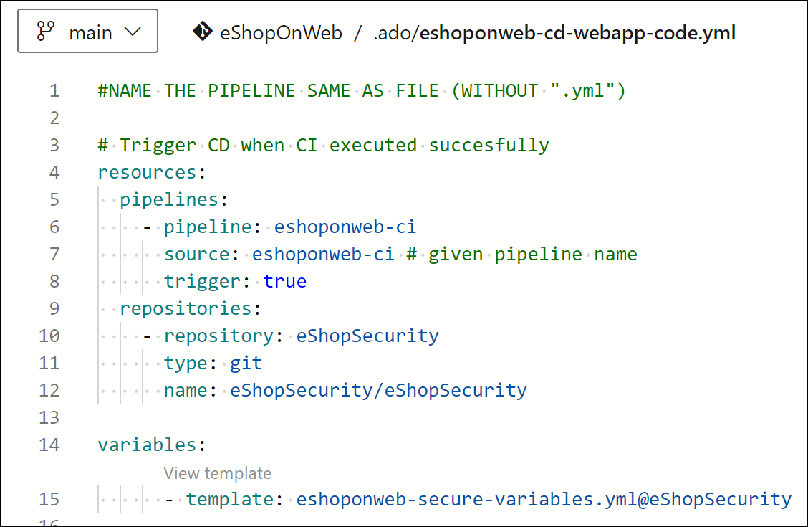

---
lab:
  title: セキュリティで保護されたパイプラインをサポートするようにプロジェクトとリポジトリの構造を構成する
  module: 'Module 1: Configure a project and repository structure to support secure pipelines'
---

# セキュリティで保護されたパイプラインをサポートするようにプロジェクトとリポジトリの構造を構成する

このラボでは、セキュリティで保護されたパイプラインをサポートするように Azure DevOps でプロジェクトとリポジトリの構造を構成する方法について学習します。 このラボでは、プロジェクトとリポジトリの編成、アクセス許可の割り当て、セキュリティで保護されたファイルの管理に関するベスト プラクティスについて説明します。

この演習は約 **30** 分かかります。

## 開始する前に

ラボに従うには、Azure サブスクリプション、Azure DevOps 組織、eShopOnWeb アプリケーションが必要です。

- 手順に [従ってラボ環境](APL2001_M00_Validate_Lab_Environment.md)を検証します。

## 手順

### 演習 1: セキュリティで保護されたプロジェクト構造を構成する

この演習では、新しいプロジェクトを作成し、プロジェクトのアクセス許可を割り当てることで、セキュリティで保護されたプロジェクト構造を構成します。 責任とリソースを、特定のアクセス許可を持つ異なるプロジェクトまたはリポジトリに分離することで、セキュリティがサポートされます。

#### タスク 1: 新しいプロジェクトを作成する

1. Azure DevOps ポータル `https://dev.azure.com` に移動し、組織を開きます。

1. **ポータル**の左下隅にある組織の設定**を開き、[全般] セクションの [プロジェクト**] を開きます。

1. [新しいプロジェクト **] オプションを**選択し、次の設定を使用します。
   - name: **eShopSecurity**
   - 可視性: **プライベート**
   - 詳細設定: バージョン コントロール: **Git**
   - 詳細設定: 作業項目プロセス: **スクラム**

    

1. **[作成]** を選択して、新しいプロジェクトを作成します。

1. これで、Azure DevOps インターフェイスの左上隅にある [プロジェクト] ドロップダウン メニューをクリックして、さまざまなチーム プロジェクトを切り替えることができるようになりました。

    

各チーム プロジェクトのアクセス許可と設定を個別に管理するには、[プロジェクトの設定] メニューに移動して、該当するチーム プロジェクトを選択します。 複数のユーザーまたはチームが異なるプロジェクトで作業している場合は、各プロジェクトに個別にアクセス許可を割り当てることもできます。

#### タスク 2: 新しいリポジトリを作成し、プロジェクトのアクセス許可を割り当てる

1. Azure DevOps ポータルの左上隅にある組織名を選択し、新しい **eShopSecurity** プロジェクトを選択します。

1. **[リポジトリ]** メニュー項目を選択します。

1. [初期化 **] ボタンを**選択して、README.md ファイルを追加して新しいリポジトリを初期化します。

1. ポータルの**左下隅にある [プロジェクト設定**] メニューを開き、[リポジトリ] セクションで [リポジトリ **] を選択**します。

1. 新しい **eShopSecurity** リポジトリを選択し、[セキュリティ **] タブを**選択します。

1. [継承] トグル ボタンをチェックして親から継承**アクセス許可を**削除します。

1. [共同作成者 **] グループを**選択し、[読み取り **] を**除く**すべてのアクセス許可の [拒否**] ドロップダウンを選択します。 これにより、共同作成者グループのすべてのユーザーがリポジトリにアクセスできなくなります。

1. [ユーザー] でユーザーを選択し、[許可 **] ボタンを**選択してすべてのアクセス許可を許可します。

    

1. (省略可能)リポジトリへのアクセス権を付与し、eShopOnWeb プロジェクトからパイプラインを実行する特定のユーザー グループまたはユーザーを追加します。 検索ボックスをクリックし、グループの名前を入力して選択し、グループまたはユーザーに対して許可または拒否するアクセス許可を設定します。

    > [!NOTE]
    > eShopOnWeb プロジェクトに同じグループがあることを確認します。 これにより、eShopOnWeb プロジェクトからパイプラインを実行し、eShopSecurity プロジェクトのリポジトリにアクセスできます。

1. 変更内容は自動的に保存されます。

これで、アクセス許可を割り当てたユーザーと管理者のみがリポジトリにアクセスできるようになりました。 これは、特定のユーザーがリポジトリにアクセスし、eShopOnWeb プロジェクトからパイプラインを実行できるようにする場合に便利です。

### 演習 2: セキュリティで保護されたパイプラインをサポートするようにパイプラインとテンプレート構造を構成する

#### タスク 1: CI パイプラインをインポートして実行する

1. Azure DevOps ポータル `https://dev.azure.com` に移動し、組織を開きます。

1. **Azure DevOps で eShopOnWeb** プロジェクトを開きます。

1. **[パイプライン] > [パイプライン]** に移動します。

1. **[パイプラインを作成]** ボタンを選択します。

1. **[Azure Repos Git (Yaml)]** を選びます。

1. **eShopOnWeb** リポジトリを選びます。

1. **[既存の Azure Pipelines YAML ファイル]** を選びます。

1. **/.ado/eshoponweb-ci.yml** ファイルを選び、 **[続行]** をクリックします。

1. **[実行]** ボタンをクリックしてパイプラインを実行します。

1. パイプラインには、プロジェクト名に基づく名前が付けられます。 パイプラインを識別しやすくするために、名前を変更しましょう。

1. **[パイプライン] > [パイプライン]** に移動し、先ほど作成したパイプラインをポイントします。 省略記号 (...) を選択してから、名前の変更を選択します。

1. **eshoponweb-ci** という名前を付け、 **[保存]** をクリックします。

#### サービス プリンシパルを作成し、Azure リソースへのアクセスを設定します。

このタスクでは、Azure CLI を使ってサービス プリンシパルを作成します。これにより、Azure DevOps で次のことができるようになります。

1. ラボのコンピューターで Web ブラウザーを起動し、Azure Portal に移動します。このラボで使用する Azure サブスクリプションで所有者ロールがあり、このサブスクリプションに関連のある Azure AD テナントでグローバル管理者ロールがあるユーザー アカウントを使ってサインインします。

1. Azure portal で、ページ上部の検索テキストボックスのすぐ右側にある **Cloud Shell** アイコンをクリックします。

1. **Bash** または **PowerShell** の選択を求めるメッセージが表示されたら、**[Bash]** を選択します。

   > [!NOTE]
   > 注: Cloud Shell を初めて起動し、[ストレージがマウントされていません] というメッセージが表示された場合は、このラボで使用しているサブスクリプションを選択し、[ストレージの作成] を選択します。

1. **Bash** プロンプトの **[Cloud Shell]** ペインで、次のコマンドを実行して、Azure サブスクリプション ID とサブスクリプション名の属性の値を取得します。

    ```bash
    az account show --query id --output tsv
    az account show --query name --output tsv
    ```

    > [!NOTE]
    > 注:両方の値をテキスト ファイルにコピーします。 これらは、このラボの後半で必要になります。

1. **Bash** プロンプトの **[Cloud Shell]** ペインで、次のコマンドを実行してサービス プリンシパルを作成します。

    ```bash
    az ad sp create-for-rbac --name myServicePrincipalName \
                         --role contributor \
                         --scopes /subscriptions/mySubscriptionID
    ```

    > [!NOTE]
    > **myServicePrincipalName を**、AzureDevOpsSP**** や mySubscriptionID** などの**文字と数字で構成される一意の文字文字列に置き換えます。

    > [!NOTE]
    > 注:このコマンドは JSON 出力を生成します。 出力をテキスト ファイルにコピーします。 このラボで後ほど必要になります。

1. 次に、Azure DevOps ポータル `https://dev.azure.com` に移動し、組織を開きます。

1. eShopOnWeb プロジェクトを**開き、ポータルの左下隅にある [プロジェクトの設定 **] を選択**** します。

1. [パイプライン] で、[サービス接続]、[サービス接続の作成] の順に選択します。

    

1. **[新しいサービス接続]** ブレードで、 **[Azure Resource Manager]** と **[次へ]** を選択します (必要に応じて下にスクロールします)。

1. **[サービス プリンシパル (自動)]** を選択し、**[次へ]** を選択します。

1. 前の手順で収集した情報を使って、空のフィールドに入力します。
    - サブスクリプション ID と名前。
    - サービス プリンシパル ID (または clientId)、Key (または Password)、TenantId。
    - **[サービス接続名]** に「**azure subs**」と入力します。 この名前は、Azure サブスクリプションと通信するために Azure DevOps サービス接続が必要になるときに、YAML パイプラインで参照されます。

        

1. [すべてのパイプラインへのアクセス許可を与える] : **確認して保存する** を選択します。

    > [!NOTE]
    > 運用環境では、 **すべてのパイプラインにアクセス許可を** 付与するオプションは推奨されません。 このラボでは、パイプラインの構成を簡略化するためにのみ使用されます。

#### タスク 3: CD パイプラインをインポートして実行する

1. **[パイプライン] > [パイプライン]** に移動します。

1. [新しいパイプライン **] ボタンを選択**します。

1. **[Azure Repos Git (Yaml)]** を選びます。

1. **eShopOnWeb** リポジトリを選びます。

1. **[既存の Azure Pipelines YAML ファイル]** を選びます。

1. **/.ado/eshoponweb-cd-webapp-code.yml** ファイルを選んで、 **[続行]** をクリックします。

1. 変数セクションの下の YAML パイプライン定義で、次をカスタマイズします。
   - **ユーザー設定の名前を持つ AZ400-EWebShop-NAME** (rg-eshoponweb-secure** など**)。
   - **リソースをデプロイする Azure リージョンの名前を持つ場所** (例: **southcentralus**)。
   - **YOUR-SUBSCRIPTION-ID** を使用する Azure サブスクリプション ID にします。
   - **グローバル一意の名前 (eshoponweb-lab-secure** など**) でデプロイする Web アプリ名を持つ az400eshop-NAME**。

1. **[保存]** を選択してメイン ブランチに直接コミットするか、このコミット用に新しいブランチを作成します。

1. もう一度 **[保存および実行]** を選択します。

    > [!NOTE]
    > 新しいブランチを作成する場合は、変更を メイン ブランチにマージするプル要求を作成する必要があります。

1. パイプラインを開きます。 重要: [This pipeline needs permission to access resources before this run can continue to Docker Compose to ACI] (ACI への Docker Compose に対してこの実行を続けるには、まずこのパイプラインにリソースにアクセスするためのアクセス許可が必要です) というメッセージが表示された場合は、[表示]、[許可]、さらにもう一度 [許可] をクリックします。 この操作は、パイプラインでリソースを作成するために必要です。

    

1. デプロイが完了するまでに数分かかる場合があり、パイプラインが実行されるまで待ちます。 CD の定義は以下のタスクで構成されます。
      - **リソース**: CI パイプラインの完了に基づいて自動的にトリガーされるように準備されています。 また、bicep ファイルのリポジトリもダウンロードします。
      - **AzureResourceManagerTemplateDeployment**: bicep テンプレートを使用して Azure Web Apps をデプロイします。
1. パイプラインには、プロジェクト名に基づく名前が付けられます。 パイプラインを識別しやすくするために、名前を変更しましょう。

1. **[パイプライン] > [パイプライン]** に移動し、先ほど作成したパイプラインをポイントします。 省略記号 (...) を選択してから、名前の変更を選択します。

1. **eshoponweb-cd-webapp-code** という名前を付け、 **[保存]** をクリックします。

eShopOnWeb プロジェクトで 2 つのパイプラインを実行する必要があります。


#### タスク 4: CD パイプライン変数を YAML テンプレートに移動する

このタスクでは、CD パイプラインで使用される変数を格納する YAML テンプレートを作成します。 これにより、他のパイプラインでテンプレートを再利用できます。

1. [リポジトリ] に移動し、[ファイル] に移動します****。****

1. .ado フォルダーを**展開し、[新しいファイル **] を選択**** します。

1. ファイル**に eshoponweb-secure-variables.yml** という名前を付け、[作成 **] を選択します**。

1. CD パイプラインで使用される variables セクションを新しいファイルに追加します。 ファイルは次のようになります。

    ```YAML
    variables:
      resource-group: 'rg-eshoponweb-secure'
      location: 'southcentralus' #name of the Azure region you want to deploy your resources
      templateFile: '.azure/bicep/webapp.bicep'
      subscriptionid: 'YOUR-SUBSCRIPTION-ID'
      azureserviceconnection: 'YOUR-AZURE-SERVICE-CONNECTION-NAME'
      webappname: 'eshoponweb-lab-secure'

    ```

    > [!IMPORTANT]
    > 変数の値を環境の値 (リソース グループ、場所、サブスクリプション ID、Azure サービス接続、Web アプリ名) に置き換えます。

1. [コミット] を選択**し、コメントを追加して、[コミット **] ボタンを選択**** します。

1. **eshoponweb-cd-webapp-code.yml** パイプライン定義を開き、variables セクションを次のように置き換えます。

    ```YAML
    variables:
      - template: eshoponweb-secure-variables.yml
    ```

    > [!NOTE]
    > テンプレート ファイルに別のパスを使用している場合は、パイプライン定義のパスを更新する必要があります。

1.  を選択して、パイプラインを保存して実行する

これで、CD パイプラインで使用される変数を含む YAML テンプレートが作成されました。 同じリソースをデプロイする必要があるシナリオでは、このテンプレートを他のパイプラインで再利用できます。 また、運用チームは、リソースがデプロイされるリソース グループと場所、およびテンプレート値内のその他の情報を制御でき、パイプライン定義に変更を加える必要はありません。

#### タスク 5: YAML テンプレートを別のリポジトリとプロジェクトに移動する

このタスクでは、YAML テンプレートを別のリポジトリとプロジェクトに移動します。

1. eShopSecurity プロジェクトで、[Repos > Files] に **移動します**。

1. eshoponweb-secure-variables.yml という名前 **の新しいファイルを作成します**。

1. ファイル **.ado/eshoponweb-secure-variables.yml** の内容を eShopOnWeb リポジトリから新しいファイルにコピーします。

1. 変更をコミットします。

1. **eShopOnWeb プロジェクトから eshoponweb-cd-webapp-code.yml** パイプライン定義を開きます。

1. リソース セクションに次の  を追加してみましょう。

    ```YAML
    resources:
      repositories:
        - repository: eShopSecurity
          type: git
          name: eShopSecurity/eShopSecurity #name of the project and repository

    ```

1. variables セクションを次の内容に置き換えます。

    ```YAML
    variables:
      - template: eshoponweb-secure-variables.yml@eShopSecurity #name of the template and repository
    ```

    

1.  を選択して、パイプラインを保存して実行する パイプラインが eShopSecurity リポジトリの YAML テンプレートを使用していることがわかります。

    

これで、別のリポジトリとプロジェクトに YAML テンプレートが作成されました。 これらのテンプレートは、同じリソースをデプロイする必要があるシナリオで、他のパイプラインで再利用できます。 また、運用チームは、リソース グループ、場所、セキュリティ、およびリソースがデプロイされる場所とテンプレート値のその他の情報を制御でき、パイプライン定義に変更を加える必要はありません。

### 演習 2: Azure リソースと Azure DevOps リソースのクリーンを実行する

この演習では、このラボで作成された Azure リソースと Azure DevOps リソースを削除します。

#### タスク 1:Azure ラボ リソースを削除する

1. Azure portal で作成したリソース グループを開き、このラボで作成されたすべてのリソースのリソース グループ**の削除を選択**します。

    ![[リソース グループ削除] ボタンのスクリーンショット。](media/delete-resource-group.png)

    > [!WARNING]
    > 新規に作成し、使用しなくなったすべての Azure リソースを削除することを忘れないでください。 使用していないリソースを削除することで、予期しない料金が発生しなくなります。

#### タスク 2: Azure DevOps パイプラインを削除する

1. Azure DevOps ポータル `https://dev.azure.com` に移動し、組織を開きます。

1. eShopOnWeb** プロジェクトを**開きます。

1. **[パイプライン] > [パイプライン]** に移動します。

1. [パイプライン] > [パイプライン **] に**移動し、既存のパイプラインを削除します。

## 確認

このラボでは、セキュリティで保護されたパイプラインをサポートするように Azure DevOps でプロジェクトとリポジトリの構造を構成する方法について学習します。 アクセス許可を効果的に管理することで、DevOps パイプラインとプロセスのセキュリティと整合性メイン維持しながら、適切なユーザーが必要なリソースにアクセスできることを確認できます。
