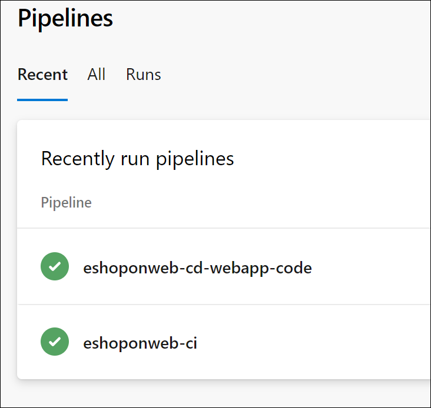

---
lab:
  title: セキュリティで保護されたパイプラインをサポートするようにプロジェクトとリポジトリの構造を構成する
  module: 'Module 1: Configure a project and repository structure to support secure pipelines'
---

# セキュリティで保護されたパイプラインをサポートするようにプロジェクトとリポジトリの構造を構成する

このラボでは、セキュリティで保護されたパイプラインをサポートするように Azure DevOps でプロジェクトとリポジトリの構造を構成する方法について学習します。 このラボでは、プロジェクトとリポジトリの編成、アクセス許可の割り当て、セキュリティで保護されたファイルの管理に関するベスト プラクティスについて説明します。

これらの演習の所要時間は約 **30** 分です。

## 開始する前に

ラボの演習を行うには、Azure サブスクリプション、Azure DevOps 組織、eShopOnWeb アプリケーションが必要です。

- 手順に従って[ラボ環境を検証](APL2001_M00_Validate_Lab_Environment.md)します。

## 手順

### 演習 1:セキュリティで保護されたプロジェクト構造を構成する

この演習では、新しいプロジェクトを作成し、プロジェクトのアクセス許可を割り当てることで、セキュリティで保護されたプロジェクト構造を構成します。 責任とリソースを、特定のアクセス許可を持つ異なるプロジェクトまたはリポジトリに分離することで、セキュリティがサポートされます。

#### タスク 1:新しいチーム プロジェクトを作成する

1. Azure DevOps ポータル (`https://dev.azure.com`) に移動し、自分の組織を開きます。

1. ポータルの左下隅にある**組織の設定**を開き、[全般] セクションで **[プロジェクト]** を選択します。

1. **[新しいプロジェクト]** オプションを選び、次の設定を使用します。

   - name: **eShopSecurity**
   - 可視性: **プライベート**
   - 詳細設定: バージョン コントロール: **Git**
   - 詳細設定: 作業項目プロセス: **スクラム**

   

1. **[作成]** を選択して、新しいプロジェクトを作成します。

1. これで、Azure DevOps ポータルの左上隅にあるAzure DevOps アイコンをクリックして、さまざまなプロジェクトを切り替えることができるようになりました。

   

各プロジェクトのアクセス許可と設定を個別に管理するには、[プロジェクトの設定] メニューに移動して、該当するチーム プロジェクトを選択します。 複数のユーザーまたはチームがさまざまなプロジェクトで作業している場合は、各プロジェクトに個別にアクセス許可を割り当てることもできます。

#### タスク 2:新しいリポジトリを作成し、プロジェクトのアクセス許可を割り当てる

1. Azure DevOps ポータルの左上隅にある組織名を選択し、新しい **eShopSecurity** プロジェクトを選択します。

1. **[Repos]** メニューを選択します。

1. README.md ファイルを追加し、**[初期化]** ボタンを選択して新しいリポジトリを初期化します。

1. ポータルの左下隅にある **[プロジェクトの設定]** メニューを開き、[Repos] セクションで **[リポジトリ]** を選択します。

1. 新しい **eShopSecurity** リポジトリを選択し、**[セキュリティ]** タブを選択します。

1. **[継承]** トグル ボタンをオフにして、親からのアクセス許可継承を削除します。

1. **共同作成者**グループを選択し、**[読み取り]** を除くすべてのアクセス許可に対して **[拒否]** ドロップダウンを選択します。 これにより、共同作成者グループのすべてのユーザーがリポジトリにアクセスできなくなります。

1. [ユーザー] でご自身のユーザーを選択し、**[許可]** ボタンを選択して、すべてのアクセス許可を許可します。

   > [!NOTE]
   > **[ユーザー]** セクションに自分の名前が表示されない場合は、**[ユーザーまたはグループの検索]** テキスト ボックスに自分の名前を入力し、結果の一覧でそれを選択します。

   

1. 変更は自動的に保存されます。

これで、アクセス許可を割り当てたユーザーと管理者のみがリポジトリにアクセスできるようになりました。 これは、特定のユーザーがリポジトリにアクセスし、eShopOnWeb プロジェクトからパイプラインを実行できるようにする場合に便利です。

### 演習 2:セキュリティで保護されたパイプラインをサポートするようにパイプラインとテンプレートの構造を構成する

#### タスク 1: CI パイプラインをインポートして実行する

1. Azure DevOps ポータル (`https://dev.azure.com`) に移動し、自分の組織を開きます。

1. Azure DevOps で **eShopOnWeb** プロジェクトを開きます。

1. **[パイプライン] > [パイプライン]** に移動します。

1. **[パイプラインを作成]** ボタンを選択します。

1. **[Azure Repos Git (Yaml)]** を選びます。

1. **eShopOnWeb** リポジトリを選びます。

1. **[既存の Azure Pipelines YAML ファイル]** を選びます。

1. **/.ado/eshoponweb-ci.yml** ファイルを選び、**[続行]** を選びます。

1. **[実行]** ボタンを選んでパイプラインを実行します。

   > [!NOTE]
   > パイプラインには、プロジェクト名に基づく名前が付けられます。 パイプラインを特定しやすいように名前を変更します。

1. **[パイプライン] > [パイプライン]** に移動し、先ほど作成したパイプラインを選択します。 省略記号を選択し、**[名前の変更/移動]** オプションを選択します。

1. **eshoponweb-ci** という名前を付けて、**[保存]** を選択します。

#### タスク 2: CD パイプラインをインポートして実行する

1. **[パイプライン] > [パイプライン]** に移動します。

1. **[新しいパイプライン]** ボタンを選択します。

1. **[Azure Repos Git (Yaml)]** を選びます。

1. **eShopOnWeb** リポジトリを選びます。

1. **[既存の Azure Pipelines YAML ファイル]** を選びます。

1. **/.ado/eshoponweb-cd-webapp-code.yml** ファイルを選択し、、**[続行]** を選択します。

1. YAML パイプライン定義の変数セクションで、次のようにカスタマイズします。

   - **AZ400-EWebShop-NAME** を任意の名前に置き換えます (たとえば、**rg-eshoponweb-secure**)。
   - **Location** は、リソースをデプロイする Azure リージョンの名前に置き換えます (たとえば、**southcentralus**)。
   - **YOUR-SUBSCRIPTION-ID** を使用する Azure サブスクリプション ID にします。
   - **az400-webapp-NAME** を、デプロイする Web アプリのグローバルに一意な名前に置き換えます。たとえば、文字列 **eshoponweb-lab-secure-** に続けてランダムな 6 桁の数字を指定します。 

1. **[保存および実行]** を選択し、メイン ブランチに直接コミットすることを選択します。

1. もう一度 **[保存および実行]** を選択します。

1. パイプライン実行を開きます。 "この実行を続行して Deploy to WebApp に進む前に、リソースにアクセスするためのアクセス許可がこのパイプラインに必要です" というメッセージが表示された場合は、**[表示]**、**[許可]**、さらにもう一度 **[許可]** を選択します。 この操作は、パイプラインで Azure App Service リソースを作成するために必要です。

   

1. デプロイが完了するまでに数分かかる場合があります。パイプラインが実行されるまで待ちます。 パイプラインは、CI パイプラインの完了後にトリガーされ、次のタスクが含まれます。

   - **AzureResourceManagerTemplateDeployment**: bicep テンプレートを使用して Azure App Service Web アプリをデプロイします。
   - **AzureRmWebAppDeployment**: Web サイトを Azure App Service Web アプリに公開します。

1. パイプラインには、プロジェクト名に基づく名前が付けられます。 パイプラインを識別しやすくするために、名前を変更しましょう。

1. **[パイプライン] > [パイプライン]** に移動し、先ほど作成したパイプラインを選択します。 省略記号を選択し、**[名前の変更/移動]** オプションを選択します。

1. **eshoponweb-cd-webapp-code** という名前を付け、**[保存]** を選択します。

これで 2 つのパイプラインが eShopOnWeb プロジェクトで実行されているはずです。



#### タスク 3:CD パイプライン変数を YAML テンプレートに移動する

このタスクでは、CD パイプラインで使用される変数を保存する YAML テンプレートを作成します。 これにより、他のパイプラインでテンプレートを再利用できるようになります。

1. **[Repos]** に移動し、次に **[ファイル]** に移動します。

1. **.ado** フォルダーを展開し、**[新しいファイル]** を選択します。

1. **eshoponweb-secure-variables.yml** ファイルに名前を付け、**[作成]** を選択します。

1. CD パイプラインで使用される変数セクションを新しいファイルに追加します。 ファイルは次のようになります。

   ```yaml
   variables:
     resource-group: 'rg-eshoponweb-secure'
     location: 'southcentralus' #the name of the Azure region you want to deploy your resources
     templateFile: 'infra/webapp.bicep'
     subscriptionid: 'YOUR-SUBSCRIPTION-ID'
     azureserviceconnection: 'azure subs' #the name of the service connection to your Azure subscription
     webappname: 'eshoponweb-lab-secure-XXXXXX' #the globally unique name of the web app
   ```

   > [!IMPORTANT]
   > 変数の値をご自身の環境の値に置き換えます (リソース グループ、場所、サブスクリプション ID、Azure サービス接続、Web アプリ名)。

1. **[コミット]** を選択し、[ommit comment]\(コミットのコメント\) テキスト ボックスに「`[skip ci]`」と入力し、**[コミット]** を選択します。

   > [!NOTE]
   > `[skip ci]` コメントをコミットに追加すると、パイプラインが自動実行されなくなります。この時点では、パイプラインは既定でリポジトリに対する変更ごとに実行されています。 

1. リポジトリ内のファイルの一覧から、**eshoponweb-cd-webapp-code.yml** パイプライン定義を開き、変数セクションを次のように置き換えます。

   ```yaml
   variables:
     - template: eshoponweb-secure-variables.yml
   ```

1. **[コミット]** を選択し、既定のコメントをそのまま使用してから、もう一度 **[コミット]** を選択してパイプラインを実行します。

1. パイプライン実行が正常に完了したことを確認します。 

これで、CD パイプラインで使用される変数を含む YAML テンプレートが作成されました。 このテンプレートは、同じリソースをデプロイする必要があるシナリオの他のパイプラインで再利用できます。 また、運用チームは、テンプレートの値で、リソース グループ、リソースがデプロイされる場所などの情報を制御できます。パイプライン定義を変更する必要はありません。

#### タスク 4:YAML テンプレートを別のリポジトリとプロジェクトに移動する

このタスクでは、YAML テンプレートを別のリポジトリとプロジェクトに移動します。

1. eShopSecurity プロジェクトで、**[Repos] > [ファイル]** に移動します。

1. **eshoponweb-secure-variables.yml** という名前の新しいファイルを作成します。

1. **.ado/eshoponweb-secure-variables.yml** ファイルの内容を eShopOnWeb リポジトリから新しいファイルにコピーします。

1. 変更をコミットします。

1. eShopOnWeb リポジトリで、**eshoponweb-cd-webapp-code.yml** パイプライン定義を開きます。

1. リソース セクションに次を追加します。

   ```yaml
     repositories:
       - repository: eShopSecurity
         type: git
         name: eShopSecurity/eShopSecurity #name of the project and repository
   ```

1. 変数セクションを以下に置き換えます。

   ```yaml
   variables:
     - template: eshoponweb-secure-variables.yml@eShopSecurity #name of the template and repository
   ```

   

1. **[コミット]** を選択し、既定のコメントをそのまま使用してから、もう一度 **[コミット]** を選択してパイプラインを実行します。

1. パイプライン実行に移動し、パイプラインで eShopSecurity リポジトリの YAML ファイルが使用されていることを確認します。

   

これで YAML テンプレートが別のリポジトリとプロジェクトに移動されました。 このファイルは、同じリソースをデプロイする必要があるシナリオの他のパイプラインで再利用できます。 また、運用チームは、YAML ファイルの値を変更することで、リソース グループ、場所、セキュリティ、リソースがデプロイされる場所などの情報を制御できます。パイプライン定義を変更する必要はありません。

### 演習 2:Azure と Azure DevOps リソースのクリーンアップを実行する

この演習では、このラボで作成した Azure と Azure DevOps のリソースを削除します。

#### タスク 1:Azure リソースを削除する

1. Azure portal で、デプロイされたリソースを含む **rg-eshoponweb-secure** リソース グループに移動し、**[リソース グループの削除]** を選択して、このラボで作成されたすべてのリソースを削除します。

   ![[リソース グループの削除] ボタンのスクリーンショット。](media/delete-resource-group.png)

   > [!WARNING]
   > 使用しなくなったすべての作成済み Azure リソースを必ず忘れずに削除してください。 使用していないリソースを削除することで、予期しない料金が発生しなくなります。

#### タスク 2:Azure DevOps パイプラインを削除する

1. Azure DevOps ポータル (`https://dev.azure.com`) に移動し、自分の組織を開きます。

1. **eShopOnWeb** プロジェクトを開きます。

1. **[パイプライン] > [パイプライン]** に移動します。

1. **[パイプライン] > [パイプライン]** に移動し、既存のパイプラインを削除します。

#### タスク 3:Azure DevOps リポジトリを再作成する

1. Azure DevOps ポータルの **eShopOnWeb** プロジェクトで、左下隅にある **[プロジェクトの設定]** を選びます。

1. 左側の **[プロジェクトの設定]** 縦型メニューの **[リポジトリ]** セクションで、**[リポジトリ]** を選択します。

1. **[すべてのリポジトリ]** ペインで、**eShopOnWeb** リポジトリ エントリの右端にマウス ポインターを置き、**[その他のオプション]** 省略記号アイコンが表示されたらそれを選択し、**[その他のオプション]** メニューで **[名前の変更]** を選択します。  

1. **[eShopOnWeb リポジトリの名前を変更する]** ウィンドウの **[リポジトリ名]** テキスト ボックスに「**eShopOnWeb_old**」と入力し、**[名前の変更]** を選択します。

1. **[すべてのリポジトリ]** ペインに戻り、**[+ 作成]** を選びます。

1. **[リポジトリの作成]** ペインの **[リポジトリ名]** テキスト ボックスに「**eShopOnWeb**」と入力し、**[Readme の追加]** チェックボックスをオフにして、**[作成]** を選びます。

1. **[すべてのリポジトリ]** ペインに戻り、**eShopOnWeb_old** リポジトリ エントリの右端にマウス ポインターを置き、**[その他のオプション]** の [...] アイコンが表示されたら、それを選びます。**[その他のオプション]** メニューで **[削除]** を選びます。  

1. **[eShopOnWeb_old リポジトリの削除]** ウィンドウで「**eShopOnWeb_old**」と入力し、**[削除]** を選びます。

1. Azure DevOps ポータルの左側のナビゲーション メニューで **[リポジトリ]** を選びます。

1. **[eShopOnWeb は空です。]** をクリックします。 ペインで **[リポジトリのインポート]** を選びます。

1. **[Git リポジトリをインポートする]** ウィンドウで、URL `https://github.com/MicrosoftLearning/eShopOnWeb` を貼り付けて、**[インポート]** を選びます。

## 確認

このラボでは、Azure DevOps でセキュリティで保護されたプロジェクトとリポジトリの構造を構成する方法について学習しました。 アクセス許可を効果的に管理することで、DevOps パイプラインとプロセスのセキュリティと整合性を維持しながら、適切なユーザーが必要なリソースにアクセスできることを保証できます。
