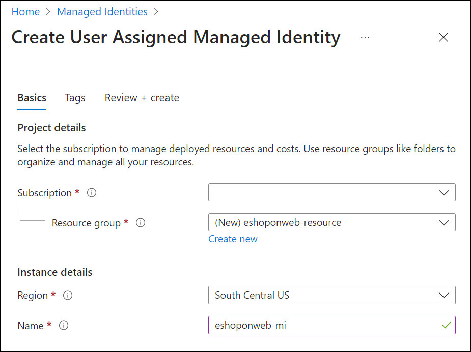

---
lab:
  title: ラボ - プロジェクトとパイプラインの ID を管理する
  module: 'Module 2: Manage identity for projects, pipelines, and agents'
---

# ラボ - プロジェクトとパイプラインの ID を管理する

マネージド ID では、Azure リソースへのアクセスを制御するための安全な方法が提供されます。 Azure により、これらの ID が自動的に処理されるため、Azure AD 認証と互換性のあるサービスへのアクセスを確認できます。 つまり、資格情報をコードに埋め込む必要がなく、セキュリティが強化されます。 Azure DevOps では、マネージド ID を使ってセルフホステッド エージェント内で Azure リソースを認証できるため、セキュリティを損なうことなくアクセス制御を簡素化できます。

このラボでは、セルフホステッド エージェントとマネージド ID で Azure DevOps を使って、YAML パイプラインで使用するマネージド ID を作成します。

この演習は約 **30** 分かかります。

## 開始する前に

ラボに従うには、Azure サブスクリプション、Azure DevOps 組織、eShopOnWeb アプリケーションが必要です。

- 手順に [従ってラボ環境](APL2001_M00_Validate_Lab_Environment.md)を検証します。

- Azure サブスクリプションで共同作成者または所有者のロールを持つ Microsoft アカウントまたは Azure AD アカウントを持っていることを確認します。 詳細については、[「Azure portal を使用して Azure ロールの割り当てを一覧表示する」](https://learn.microsoft.com/azure/role-based-access-control/role-assignments-list-portal)および[「Azure Active Directory で管理者ロールを表示して割当てる」](https://learn.microsoft.com/azure/active-directory/roles/manage-roles-portal)を参照してください。

## 手順

### 演習 1: CI/CD パイプラインをインポートして実行する。

この演習では、CI パイプラインをインポートして実行し、サービスの Azure サブスクリプションとの接続を構成し、CD パイプラインをインポートして実行します。

#### タスク 1: CI パイプラインをインポートして実行する

まず、[eshoponweb-ci.yml](https://github.com/MicrosoftLearning/eShopOnWeb/blob/main/.ado/eshoponweb-ci.yml) という CI パイプラインをインポートします。

1. Azure DevOps ポータル `https://dev.azure.com` に移動し、組織を開きます。

1. eShopOnWeb** プロジェクトを**開きます。

1. **[パイプライン] > [パイプライン]** に移動します。

1. [新しいパイプライン **] ボタンを選択**します。

1. **[Azure Repos Git (Yaml)]** を選びます。

1. **eShopOnWeb** リポジトリを選びます。

1. **[既存の Azure Pipelines YAML ファイル]** を選びます。

1. **/.ado/eshoponweb-ci.yml** ファイルを選び、 **[続行]** をクリックします。

1. **[実行]** ボタンをクリックしてパイプラインを実行します。

    > [!NOTE]
    > パイプラインには、プロジェクト名に基づく名前が付けられます。 パイプラインを識別しやすくするために、名前を変更しましょう。

1. Pipelines > Pipelines** に移動し**、最近作成したパイプラインを選択し、省略記号を選択して、[名前の変更/移動 **] オプションを選択**します。

1. **eshoponweb-ci** という名前を付け、 **[保存]** をクリックします。

#### タスク 2: サービス接続を管理する

Azure Pipelines から外部およびリモート サービスへの接続を作成し、ジョブのタスクを実行できます。

このタスクでは、Azure CLI を使ってサービス プリンシパルを作成します。これにより、Azure DevOps で次のことができるようになります。

- Azure サブスクリプションでリソースをデプロイする
- eShopOnWeb アプリケーションをデプロイする

> [!NOTE]
> Azure subs** という名前**の Azure サブスクリプションにサービス プリンシパルとサービス接続が既にある場合は、次のタスクに直接進むことができます。

Azure Pipelines から Azure リソースをデプロイするには、サービス プリンシパルが必要です。

サービス プリンシパルは、パイプライン定義内から Azure サブスクリプションに接続するとき、またはプロジェクト設定ページから新しいサービス接続を作成するときに (自動オプション)、Azure パイプラインによって自動的に作成されます。 ポータルから、または Azure CLI を使用してサービス プリンシパルを手動で作成し、プロジェクト間で再利用することもできます。

1. ラボのコンピューターで Web ブラウザーを起動し、Azure Portal に移動します。このラボで使用する Azure サブスクリプションで所有者ロールがあり、このサブスクリプションに関連のある Azure AD テナントでグローバル管理者ロールがあるユーザー アカウントを使ってサインインします。

1. Azure portal で、ページ上部の検索テキスト ボックスのすぐ右側にある **Cloud Shell** アイコンをクリックします。

1. **Bash** または **PowerShell** の選択を求めるメッセージが表示されたら、**[Bash]** を選択します。

   > [!NOTE]
   > 注: Cloud Shell を初めて起動し、[ストレージがマウントされていません] というメッセージが表示された場合は、このラボで使用しているサブスクリプションを選択し、[ストレージの作成] を選択します。

1. **Bash** プロンプトの **[Cloud Shell]** ペインで、次のコマンドを実行して、Azure サブスクリプション ID の属性の値を取得します。

    ```sh
    subscriptionName=$(az account show --query name --output tsv)
    subscriptionId=$(az account show --query id --output tsv)
    echo $subscriptionName
    echo $subscriptionId
    ```

    > [!NOTE]
    > 注:両方の値をテキスト ファイルにコピーします。 これらは、このラボの後半で必要になります。

1. **Bash** プロンプトの **[Cloud Shell]** ペインで、次のコマンドを実行してサービス プリンシパルを作成します。

    ```sh
    az ad sp create-for-rbac --name sp-eshoponweb-azdo --role contributor --scopes /subscriptions/$subscriptionId
    ```

    > [!NOTE]
    > 注:このコマンドは JSON 出力を生成します。 出力をテキスト ファイルにコピーします。 このラボで後ほど必要になります。

1. Azure DevOps Portal ( から EShopOnWeb プロジェクトに移動します。 **[プロジェクトの設定] > [サービス接続] ([パイプライン] の下)** 、 **[新しいサービス接続]** の順にクリックします。

1. **[新しいサービス接続]** ブレードで、 **[Azure Resource Manager]** と **[次へ]** を選択します (必要に応じて下にスクロールします)。

1. **[サービス プリンシパル (自動)]** を選択し、**[次へ]** を選択します。

1. 前の手順で収集した情報を使って、空のフィールドに入力します。
    - サブスクリプション ID と名前。
    - サービス プリンシパル ID (または clientId)、Key (または Password)、TenantId。
    - **[サービス接続名]** に「**azure subs**」と入力します。 この名前は、Azure サブスクリプションと通信するために Azure DevOps サービス接続が必要になるときに、YAML パイプラインで参照されます。

1. **確認して保存する** を選択します。

#### タスク 3: CD パイプラインをインポートして実行する

[eshoponweb-cd-webapp-code.yml](https://github.com/MicrosoftLearning/eShopOnWeb/blob/main/.ado/eshoponweb-cd-webapp-code.yml) という名前の CD パイプラインをインポートしてみましょう。

1. **[パイプライン] > [パイプライン]** に移動します。

1. **[新しいパイプライン]** ボタンをクリックします。

1. **[Azure Repos Git (Yaml)]** を選びます。

1. **eShopOnWeb** リポジトリを選びます。

1. **[既存の Azure Pipelines YAML ファイル]** を選びます。

1. **/.ado/eshoponweb-cd-webapp-code.yml** ファイルを選んで、 **[続行]** をクリックします。

1. YAML パイプライン定義で、variables セクションを次の値に設定します。

    ```YAML
    variables:
      resource-group: 'AZ400-EWebShop-NAME'
      location: 'westeurope'
      templateFile: '.azure/bicep/webapp.bicep'
      subscriptionid: 'YOUR-SUBSCRIPTION-ID'
      azureserviceconnection: 'azure subs'
      webappname: 'az400-webapp-NAME'
    ```

1. 上のコマンドのプレースホルダーを次の値に置き換えます。

   - **ユーザー設定の名前を持つ AZ400-EWebShop-NAME** (rg-eshoponweb** など**)。
   - **リソースをデプロイする Azure リージョンの名前を持つ場所** (例: **southcentralus**)。
   - **YOUR-SUBSCRIPTION-ID** を使用する Azure サブスクリプション ID にします。
   - **az400-webapp-NAME**。グローバル一意の名前でデプロイされる Web アプリ名 (例 **: eshoponweb-lab-YOURNAME**)。

1. リソース セクションに存在する場合は、次のエントリを削除します。

    ```YAML
    repositories:
      - repository: eShopSecurity
        type: git
        name: eShopSecurity/eShopSecurity #name of the project and repository
    ```

1. **[保存]** を選択してメイン ブランチに直接コミットするか、このコミット用に新しいブランチを作成します。

1. もう一度 **[保存および実行]** を選択します。

    > [!NOTE]
    > 新しいブランチを作成する場合は、変更を メイン ブランチにマージするプル要求を作成する必要があります。

1. パイプラインを開きます。 重要: [This pipeline needs permission to access resources before this run can continue to Docker Compose to ACI] (ACI への Docker Compose に対してこの実行を続けるには、まずこのパイプラインにリソースにアクセスするためのアクセス許可が必要です) というメッセージが表示された場合は、[表示]、[許可]、さらにもう一度 [許可] をクリックします。 この操作は、パイプラインでリソースを作成するために必要です。

    

1. デプロイが完了するまでに数分かかる場合があり、パイプラインが実行されるまで待ちます。 CD の定義は以下のタスクで構成されます。
      - **リソース**: CI パイプラインの完了に基づいて自動的にトリガーされるように準備されています。 また、bicep ファイルのリポジトリもダウンロードします。
      - **AzureResourceManagerTemplateDeployment**: bicep テンプレートを使用して Azure Web Apps をデプロイします。

1. パイプラインには、プロジェクト名に基づく名前が付けられます。 パイプラインを識別しやすくするために、**名前を変更**しましょう。

1. Pipelines > Pipelines** に移動し**、最近作成したパイプラインを選択し、省略記号を選択して、[名前の変更/移動 **] オプションを選択**します。

1. **eshoponweb-cd-webapp-code** という名前を付け、 **[保存]** をクリックします。

### 演習 2: サービス接続のマネージド ID を作成する

この演習では、マネージド ID を作成し、CI/CD パイプラインで使用する新しいサービス接続を作成します。

#### システム マネージド ID を作成する

1. ブラウザーで、Azure Portal を開きます。

1. [リソース、サービス、ドキュメントの**検索 (G+/)]** ボックスに「マネージド ID」と**入力**し、ドロップダウン リストから選択します。

    ![Azure portal の [マネージド サービス ID] ページのスクリーンショット。](media/managed-identities.png)

1. 先ほど作成したマネージド ID を選択します。

1. [マネージド ID の**作成] **ウィンドウで、必要な情報を入力します。
   - **Azure サブスクリプション** を含むサブスクリプション。
   - **リソース グループ**: 新規または既存のリソース グループ。
   - **リージョン** が自分の場所に近いか、リソースで使用可能なリージョン。
   - **ユーザー** 設定のマネージド ID 名を持つ名前 (例: **eshoponweb-mi**)。

    

    > [!NOTE]
    > リソース グループがない場合は、[新しい**作成] **リンクをクリックして作成できます。

1. **[確認と作成]**、**[作成]** の順に選択します。

#### マネージド ID にアクセス許可を割り当てる

次に、マネージド ID のアクセス許可をリソース グループとアプリ サービスに割り当てる必要があります。

1. Azure portal で、作成したユーザー割り当てマネージド ID に移動します。

1. [許可] **サイド メニューから [Azure ロールの** 割り当て] タブを選択します。

1. [ロールの割り当ての**追加] **ボタンを選択し、次のアクションを実行します。

    | 設定 | 操作 |
    | -- | -- |
    | **[イメージ]** ドロップダウン リスト | **[リソース グループ]** を選択します。 |
    | **[サブスクリプション]** ドロップダウン リスト | Azure サブスクリプションを選択します。 |
    | **[リソース グループ]** ドロップダウン リスト | 既存のリソース グループ AZ801-L0601-RG を選択します |
    | [テーブル] ドロップダウン リスト | **[共同作成者]** ロールを選択します。 |

1. **保存**ボタンを選択します。

    ![[割り当ての追加] ペインのスクリーンショット。](media/add-role-assignment.png)

### 演習 3: セルフホステッド エージェントとマネージド ID を使用して新しい Azure 仮想マシンを作成し、CI パイプラインを更新する

この演習では、セルフホステッド エージェントと前の演習で作成したマネージド ID を使用して、新しい Azure 仮想マシンを作成します。 次に、新しい Azure 仮想マシンを使用するように CI パイプラインを更新します。

#### Azure 上で新しい仮想マシンを作成するため

1. ブラウザーで、Azure Portal を開きます。

1. [リソース、サービス、ドキュメントの**検索 (G+/)]** ボックスに「Virtual Machines **」と入力**し、ドロップダウン リストから選択します。

1. **[作成]** ボタンを選択します。

1. [仮想マシン] で、**[+ 追加] > [+ プリセット構成で開始]** を選択します。

    

1. **ワークロード環境として開発/テスト**を選択し、ワークロードの**種類として汎用**を選択します。

1. [続行して VM** を作成する] **ボタンを選択し、[基本 **] **タブで次の操作を実行し、[管理 **] タブを選択**します。

    | 設定 | アクション |
    | -- | -- |
    | **[サブスクリプション]** ドロップダウン リスト | Azure サブスクリプションを選択します。 |
    | **[リソース グループ]** セクション | eshoponweb-resource など、 **既存または新しいリソース グループを選択します**。 |
    | **[仮想マシン名** ] テキスト ボックス | ユーザー設定の名前 (例: **eshoponweb-vm) を入力します**。 |
    | **[リージョン]** ドロップダウン リスト | 場所に近いリージョン、またはリソースで使用可能なリージョン (米国**中南部など**) を選択します。 |
    | **[可用性オプション** ] ドロップダウン リスト | **[インフラストラクチャ冗長は必要ありません]** を選択します。 |
    | **[セキュリティの種類** ] ドロップダウン リスト | [信頼された起動仮想マシン **] オプションを**使用して選択します。 |
    | **[イメージ]** ドロップダウン リスト | Imageに[Windows Server 2019 Datacenter]を選択します。 |
    | **[イメージ]** ドロップダウン リスト | テスト目的で最も **安価な Standard** サイズを選択します。 |
    | ユーザー名テキスト ボックス | ユーザー設定のユーザー名を入力します |
    | パスワード テキスト ボックス。 | ユーザー設定のパスワードを入力します |
    | **[パブリック受信ポート]** :なし。 | **[選択したポートを許可する]** を選択します。 |
    | **[受信ポート** の選択] ドロップダウン リスト | **[RDP (3389)]** を選択します。 |

1. **[Docker]** タブで、次のアクションを実行し、 **[確認と作成]** を選択します。
   
    | **システム割り当てマネージド ID の**有効化セクション |チェックボックスを選択**します**。 これにより、作成したマネージド ID を VM で使用できるようになります。 | |**[パブリック IP アドレス]** セクション |[新規作成 **] を選択**し、ユーザー設定の名前を入力して、[OK] を選択**します。** |

    > [!IMPORTANT]
    > 「演習 5: 予期しない料金を回避するために Azure ラボ リソースを削除する」の手順をスキップしないでください。

1. **[確認および作成]** タブで、 **[作成]** を選択します。

1. 仮想マシンの設定を開き、[ID **] タブを**選択し、[Azure ロールの**割り当て] ボタンを**選択します。

1. **[ロールの割り当ての追加]** ボタンを選びます。

1. サブスクリプションスコープ、サブスクリプション、共同作成者**ロールを**選択します。

1. **保存**ボタンを選択します。

#### タスク 2: 新しい Azure 仮想マシンを開き、セルフホステッド エージェントをインストールする

1. RDP 接続を使用して、先ほど作成した新しい Azure 仮想マシンを開きます。 接続情報は、[接続] ボタンを**** チェック**** 概要で確認できます。

2. Azure VM から、手順に従って、ラボの演習 1 から新しい Azure 仮想マシン [にエージェントをインストールし、セキュリティで保護されたパイプライン用にエージェントとエージェント プールを構成します](APL2001_M03_L03_Configure_Agents_And_Agent_Pools_for_Secure_Pipelines.md)。 手順に従うときは、次の変更を考慮してください。

   - タスク 1 の手順 5 で、エージェント プール**に eShopOnWebSelfPoolManaged** (eShopOnWebSelfPool** ではなく**) という名前を付けます。
   - タスク 4 の手順 3 で、エージェント**に eShopOnWebSelfAgentManaged** (eShopOnWebSelfAgent** ではなく**) という名前を付けます。
   - タスク 4、手順 3 でユーザー アカウントの構成中にサービスを実行するアカウントとして NT AUTHORITY\NETWORK Standard Edition RVICE** を選択**します。

3. エージェントをインストールしたら、Azure DevOps ポータルでエージェント プールを開き、新しいエージェントが使用可能であることをチェックします。

    

### 演習 4: マネージド ID を使用して新しいサービス接続を作成し、CD パイプラインを更新する

この演習では、マネージド ID 認証方法を使用して新しいサービス接続を作成します。 次に、新しいサービス接続を使用するように CD パイプラインを更新します。

#### 新しいサービス接続を作成する。

1. Azure DevOps ポータル `https://dev.azure.com` に移動し、組織を開きます。

1. eShopOnWeb プロジェクトを**開き、サービス接続 **>プロジェクト設定に**移動**します。

1. [新しいサービス接続] ボタンをクリックし、[Azure Resource Manager] を選択します。

1. [認証方法] セクションで、[マネージド ID] を選択します。

1. 前の手順で収集した情報を使って、空のフィールドに入力します。
    - サブスクリプション ID、名前、テナント ID (または clientId)。
    - **[サービス接続名]** に「**azure subs**」と入力します。 この名前は、Azure サブスクリプションと通信するために Azure DevOps サービス接続が必要になるときに、YAML パイプラインで参照されます。

1. 確認して保存する を選択します。

#### タスク 2: CD パイプラインを更新する

1. Azure DevOps ポータル `https://dev.azure.com` に移動し、組織を開きます。

1. eShopOnWeb プロジェクトを**開き、[Pipelines > Pipelines] に**移動します**。**

1. **eshoponweb-cd-webapp-code** パイプラインを選択し、[編集] を選択します****。

1. variables セクションで、前のタスク**で作成した**サービス接続の名前 (azure subs managed**) で serviceConnection** 変数を更新します。

    ```YAML
          azureserviceconnection: 'azure subs managed'
    ```

1. ステージ** セクションの ****jobs** サブセクションで、プール** プロパティの値を更新して、前の**演習**で作成したセルフホステッド エージェント プール eShopOnWebSelfPoolManaged** を参照するようにします。この形式は次のとおりです。

    ```YAML    
          jobs:
          - job: Deploy
            pool: eShopOnWebSelfPoolManaged
            steps:
            #download artifacts
            - download: eshoponweb-ci
    ```

1. **[保存]** を選択してメイン ブランチに直接コミットするか、このコミット用に新しいブランチを作成します。

1. **保存**を再度選択します。

    > [!NOTE]
    > 新しいブランチを作成する場合は、変更を メイン ブランチにマージするプル要求を作成する必要があります。

1. [パイプラインの実行 **] を**選択し、[再実行]** **をクリックします。

1. パイプラインを開きます。 重要: [This pipeline needs permission to access resources before this run can continue to Docker Compose to ACI] (ACI への Docker Compose に対してこの実行を続けるには、まずこのパイプラインにリソースにアクセスするためのアクセス許可が必要です) というメッセージが表示された場合は、[表示]、[許可]、さらにもう一度 [許可] をクリックします。 この操作は、パイプラインでリソースを作成するために必要です。

1. デプロイが完了するまでに数分かかる場合があり、パイプラインが実行されるまで待ちます。

1. パイプラインログから、パイプラインがマネージド ID を使用していることを確認できます。

    

パイプラインが完了したら、Azure portal に移動し、新しい App Service リソースをチェックできます。

### 演習 5: Azure ラボ リソースを削除する

1. Azure portal で作成したリソース グループを開き、このラボで作成されたすべてのリソースのリソース グループ**の削除を選択**します。

    ![[リソース グループ削除] ボタンのスクリーンショット。](media/delete-resource-group.png)

    > [!WARNING]
    > 新規に作成し、使用しなくなったすべての Azure リソースを削除することを忘れないでください。 使用していないリソースを削除することで、予期しない料金が発生しなくなります。

## 確認

このラボでは、構成を動的に有効にし、機能フラグを管理する方法を学びました。
