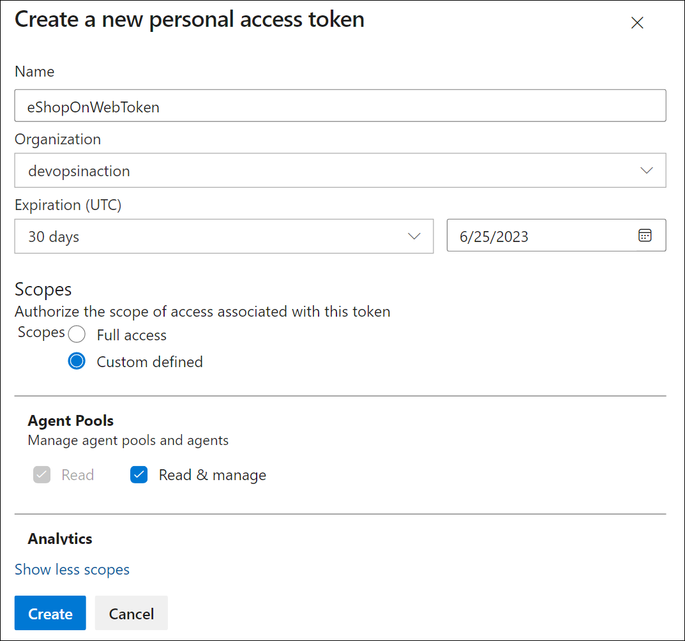
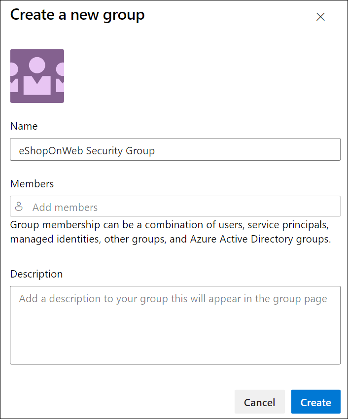

---
lab:
  title: セキュリティで保護されたパイプライン用にエージェントとエージェント プールを構成する
  module: 'Module 3: Configure secure access to pipeline resources'
---

# セキュリティで保護されたパイプライン用にエージェントとエージェント プールを構成する

このラボでは、Azure DevOps エージェントとエージェント プールを構成し、それらのプールのアクセス許可を管理する方法について学習します。 Azure DevOps エージェント プールには、ビルドおよびリリース パイプラインを実行するためのリソースが用意されています。

この演習には、約 **25** 分かかります。

## 開始する前に

ラボの演習を行うには、Azure サブスクリプション、Azure DevOps 組織、eShopOnWeb アプリケーションが必要です。

- 手順に従って[ラボ環境を検証](APL2001_M00_Validate_Lab_Environment.md)します。
- エージェント構成の PAT トークン。

## 手順

エージェントを作成し、Windows を使用してセルフホステッド エージェントを構成します。 Linux または macOS でエージェントを構成する場合は、[Azure DevOps ドキュメント](https://docs.microsoft.com/azure/devops/pipelines/agents/v2-linux)の手順を行います。

構成時は、次の点に注意してください。

- **プロジェクトごとに個別のエージェントを維持する**: 各エージェントは、1 つのプールにのみ関連付けることができます。 プロジェクト間でエージェント プールを共有すると、インフラストラクチャ コストを節約できますが、横移動のリスクも生じます。 そのため、相互感染を防ぐために、プロジェクトごとに専用エージェントを含む個別のエージェント プールを用意することをお勧めしています。
- **特権の低いアカウントを使用してエージェントを実行する**: Azure DevOps リソースに直接アクセスできる ID でエージェントを実行すると、セキュリティ上の脅威が発生する可能性があります。 Network Service などの特権のないローカル アカウントでエージェントを操作することをお勧めします。これにより、リスクが最小限に抑えられます。
- **誤解を招くグループ名に注意する**: Azure DevOps の「プロジェクト コレクション サービス アカウント」グループは潜在的なセキュリティ リスクがあります。 このグループの一部であり、Azure AD によってサポートされている ID を使用してエージェントを実行すると、Azure DevOps 組織全体のセキュリティが危険にさらされる可能性があります。
- **セルフホステッド エージェントに高い特権のアカウントを使用しないようにする**: 高い特権のアカウントを使用してセルフホステッド エージェントを実行すると、特にシークレットや運用環境にアクセスする場合、パイプラインが侵害されたときにシステムが重大な脅威にさらされる可能性があります。
- **セキュリティに優先順位を付ける**: システムを保護するには、最小限の特権アカウントを使用してセルフホステッド エージェントを実行します。 たとえば、お使いのマシンのアカウントやマネージド サービス ID を使用してください。 また、Azure Pipelines がシークレットと環境へのアクセスを処理できるようにすることもお勧めします。

### 演習 1: エージェントを作成し、エージェント プールを構成する

この演習では、エージェントを作成し、エージェント プールを構成します。

#### タスク 1: エージェント プールを作成する

1. Azure DevOps ポータル (`https://dev.azure.com`) に移動し、自分の組織を開きます。

1. **eShopOnWeb** プロジェクトを開き、左側の下部メニューから **[プロジェクトの設定]** を選びます。

1. **[パイプライン] > [エージェント プール]** で、**[プールの追加]** を選びます。

1. プールのタイプとして **[セルフホステッド]** を選びます。

1. エージェント プールの名前 (**eShopOnWebSelfPool** など) を指定し、オプションの説明を追加します。

1. **[すべてのパイプラインにアクセス権を付与する]** オプションをオフにします。

    

1. **[作成]** を選び、エージェント プールを作成します。

#### タスク 2: エージェントを作成する

1. 新しく作成したエージェント プールを選び、**[エージェント]** タブを選びます。

1. **[新しいエージェント]** を選び、新しいポップアップ ウィンドウの **[エージェントのダウンロード]** から **[ダウンロード]** を選びます。

1. インストール手順に従って、ポップアップ ウィンドウからマシンにエージェントをインストールします。
   1. PowerShell から次のコマンドを実行して、マシンに新しいエージェント フォルダーを作成します。

        ```powershell
        mkdir agent ; cd agent        
        ```

        > [!NOTE]
        > ユーザー プロファイルのルート フォルダー、またはエージェントをインストールするフォルダーを開いていることを確かめます。

   2. マシンの**ダウンロード**フォルダーを選んだ場合は、PowerShell から、次に示す推奨コマンドを実行します。

        ```powershell
        Add-Type -AssemblyName System.IO.Compression.FileSystem ; [SysteIO.Compression.ZipFile]::ExtractToDirecto("$HOME\Downloads\vsts-agent-win-x64-3.220.2.zip", "$PWD")
        
        ```
        > [!NOTE]
        > エージェントを別の場所にダウンロードした場合は、上記のコマンドのパスを置き換えます。

#### タスク 3: PAT トークンを作成する

エージェントを構成する前に、新しい PAT トークンを作成するか、既存の PAT トークンを選びます。 以下の手順に従って、新しい PAT トークンを作成します。

1. Azure DevOps ポータル (`https://dev.azure.com`) に移動し、自分の組織を開きます。

1. eShopOnWeb プロジェクトに移動し、右側の上部メニュー (ユーザー プロファイル画像の左側) から **[ユーザー設定]** を選びます。

1. **[個人用アクセス トークン]** を選びます。

    ![[個人用アクセス トークン] メニューを示すスクリーンショット。](media/personal-access-token-menu.png)

1. **[新しいトークン]** を選びます。

1. トークンの名前を指定します (**eShopOnWebToken** など)。

1. トークンを使用する Azure DevOps 組織を選択します。

1. トークンの有効期限を設定します (エージェントの構成にのみ使用されます)。

1. カスタム定義されたスコープを選択します。

1. すべてのスコープを表示する場合に選択します。

1. **エージェント プール (読み取りおよび管理)** スコープを選択します。

1. **[作成]** を選び、トークンを作成します。

1. トークンの値をコピーし、安全な場所に保存します (再度表示することはできません。 再生成できるのはトークンだけです)。

    

    > [!IMPORTANT]
    > 最後の権限オプションである**エージェント プール (読み取りと管理)** は、エージェント構成にのみ使用します。 また、これがトークンの唯一の目的である場合は、トークンの最小有効期限を必ず設定します。 エージェントをもう一度構成する必要がある場合は、同じ権限で新しいトークンを作成できます。

#### タスク 4: エージェントを構成する

1. 新しい PowerShell ウィンドウを開き、前の手順で作成したエージェント フォルダーに移動します。

1. 次のコマンドを実行して、エージェントを構成します。

    ```powershell
    .\config.cmd
    ```

    > [!NOTE]
    > 必要に応じて .\run.cmd を実行し、対話形式でエージェントを実行します。 対話形式で実行しているときにコマンド プロンプト ウィンドウを閉じることはできません。

1. エージェントを構成するように求められたら、次の情報を入力します。
    - Azure DevOps 組織の URL を入力します: `https://dev.azure.com/`{your organization name}。
    - 認証の種類を選択します: **PAT**。
    - 前の手順で作成した PAT トークンの値を入力します。
    - 前の手順で作成したエージェント プール名「**eShopOnWebSelfPool**」を入力します。
    - エージェント名「**eShopOnWebSelfAgent**」を入力します。
    - エージェントの作業フォルダーを選択します (既定は _work)。
    - エージェントの実行モードを選択します (サービスとして実行する場合は Y)。
    - エージェント サービスの SERVICE_SID_TYPE_UNRESTRICTED を有効にするには、「Y」を入力します (Windows のみ)。
    - サービスに使用するユーザー アカウントを入力します。

        > [!IMPORTANT]
        > エージェント サービスを実行する場合は、高い権限を持つアカウントを使用しないようにします。 代わりに、サービスの操作に必要な最小限のアクセス許可を保持する、低い権限のアカウントを使用します。 このアプローチは、安全かつ安定した環境を維持するのに役立ちます。

    - 構成が完了した直後にサービスを開始しないようにするかどうか (サービスを開始する場合は N) を入力します。

        

    - エージェント プールに移動し、**[エージェント]** タブをクリックして、エージェントの状態を確認します。新しいエージェントが一覧に表示されます。

        

Windows エージェントの詳細については、「[セルフホステッド Windows エージェント](https://learn.microsoft.com/azure/devops/pipelines/agents/windows-agent)」をご覧ください。

### 演習 2: エージェント プールの新しいセキュリティ グループを作成して構成する

この演習では、エージェント プールの新しいセキュリティ グループを作成します。

#### タスク 1: 新しいセキュリティ グループを作成する

1. Azure DevOps ポータル (`https://dev.azure.com`) に移動し、自分の組織を開きます。

1. **eShopOnWeb** プロジェクトを開き、左側の下部メニューから **[プロジェクトの設定]** を選びます。

1. [全般] で [アクセス許可] を開きます。

1. **[新しいグループ]** を選びます。

1. グループの名前を指定します (**eShopOnWeb セキュリティ グループ**など)。

1. グループに含めるユーザーを追加します。

1. **[作成]** を選び、グループを作成します。

    

#### タスク 2: セキュリティ グループを構成する

1. 新しいグループを選択して、**[アクセス許可]** タブを表示します。

1. グループの不要なアクセス許可 (**チーム プロジェクトの名前の変更**、**作業項目の完全な削除**など) を拒否します。また、エージェント プールでのみ使用されるため、グループに付与したくないその他のアクセス許可も拒否します。

    

    > [!IMPORTANT]
    > グループに付与したくないアクセス許可を残しておくと、エージェントで実行されているスクリプトまたはタスクは、グループのアクセス許可を使用して、実行してほしくないアクションを実行できます。

### 演習 3: エージェント プールのアクセス許可を管理する

この演習では、エージェント プールのアクセス許可を管理します。

1. Azure DevOps ポータル (`https://dev.azure.com`) に移動し、自分の組織を開きます。

1. **eShopOnWeb** プロジェクトを開き、左側の下部メニューから **[プロジェクトの設定]** を選びます。

1. **[パイプライン]**、**[エージェント プール]** の順に選びます。

1. **eShopOnWebSelfPool** エージェント プールを選びます。

1. エージェント プールの詳細ビューで、**[セキュリティ]** タブを選びます。

1. **[追加]** を選び、新しいグループ、**eShopOnWeb セキュリティ グループ**をエージェント プールのユーザーのアクセス許可に追加します。

1. エージェント プール閲覧者、ユーザー、管理者など、ユーザーまたはグループに適したロールを選びます。 この場合は、**ユーザー**を選びます。

1. [追加] を選び、アクセス許可を適用します。

    

これで、パイプラインでエージェント プールを安全に使用する準備ができました。 エージェント プールの詳細については、「[エージェント プール](https://learn.microsoft.com/azure/devops/pipelines/agents/pools-queues)」をご覧ください。

### 演習 4: ラボで使用されているリソースを削除する

1. `.config.cmd remove` を実行して、エージェント サービスの停止と削除を行います。

1. エージェント プールを削除します。

1. セキュリティ グループを削除します。

1. PAT トークンを取り消します。

## 確認

このラボでは、Azure DevOps セルフホステッド エージェントとエージェント プールを構成し、それらのプールのアクセス許可を管理する方法について学習します。 アクセス許可を効果的に管理することで、DevOps プロセスのセキュリティと整合性を維持しながら、適切なユーザーが必要なリソースにアクセスできるようにすることができます。
