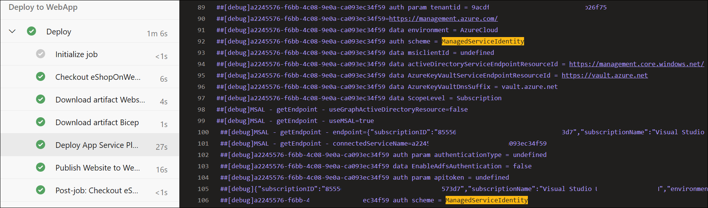

---
lab:
  title: プロジェクトとパイプラインのマネージド ID
  module: 'Module 3: Manage identity for projects, pipelines, and agents'
---

# プロジェクトとパイプラインのマネージド ID

マネージド ID では、Azure リソースへのアクセスを制御するための安全な方法が提供されます。 Azure により、これらの ID が自動的に処理されるため、Azure AD 認証と互換性のあるサービスへのアクセスを確認できます。 つまり、資格情報をコードに埋め込む必要がなく、セキュリティが強化されます。 Azure DevOps では、マネージド ID を使ってセルフホステッド エージェント内で Azure リソースを認証できるため、セキュリティを損なうことなくアクセス制御を簡素化できます。

このラボでは、マネージド ID を作成し、セルフホステッド エージェントで実行されている Azure DevOps YAML パイプラインでそれを使用して、Azure リソースをデプロイします。

このラボには約 **45** 分かかります。

## 開始する前に

ラボの演習を行うには、Azure サブスクリプション、Azure DevOps 組織、eShopOnWeb アプリケーションが必要です。

- 手順に従って[ラボ環境を検証](APL2001_M00_Validate_Lab_Environment.md)します。
- Azure サブスクリプションで共同作成者または所有者のロールを持つ Microsoft アカウントまたは Microsoft Entra アカウントを持っていることを確認します。 詳細については、[「Azure portal を使用して Azure ロールの割り当てを一覧表示する」](https://learn.microsoft.com/azure/role-based-access-control/role-assignments-list-portal)および[「Azure Active Directory で管理者ロールを表示して割当てる」](https://learn.microsoft.com/azure/active-directory/roles/manage-roles-portal)を参照してください。
- [セキュリティで保護されたパイプライン用にエージェントとエージェント プールを構成](APL2001_M03_L02_Configure_Agents_And_Agent_Pools_for_Secure_Pipelines.md)するラボを完了する。

## 手順

### 演習 1:CI/CD パイプラインをインポートして実行する

この演習では、CI パイプラインをインポートして実行し、サービスの Azure サブスクリプションとの接続を構成し、CD パイプラインをインポートして実行します。

#### タスク 1: CI パイプラインをインポートして実行する

まず、[eshoponweb-ci.yml](https://github.com/MicrosoftLearning/eShopOnWeb/blob/main/.ado/eshoponweb-ci.yml) という CI パイプラインをインポートします。

1. Azure DevOps ポータル (`https://dev.azure.com`) に移動し、自分の組織を開きます。

1. **eShopOnWeb** プロジェクトを開きます。

1. **[パイプライン] > [パイプライン]** に移動します。

1. **[パイプラインを作成]** ボタンを選択します。

1. **[Azure Repos Git (Yaml)]** を選びます。

1. **eShopOnWeb** リポジトリを選びます。

1. **[既存の Azure Pipelines YAML ファイル]** を選びます。

1. **/.ado/eshoponweb-ci.yml** ファイルを選び、 **[続行]** をクリックします。

1. **[実行]** ボタンを選んでパイプラインを実行します。

   > [!NOTE]
   > パイプラインには、プロジェクト名に基づく名前が付けられます。 名前を変更してパイプラインを識別しやすくします。

1. **[パイプライン] > [パイプライン]** に移動し、先ほど作成したパイプラインを選び、[...] を選んで **[名前の変更/移動]** オプションを選びます。

1. 「**eshoponweb-ci**」という名前を付け、**[保存]** を選びます。

#### タスク 2: CD パイプラインをインポートして実行する

> [!NOTE]
> このタスクでは、[eshoponweb-cd-webapp-code.yml](https://github.com/MicrosoftLearning/eShopOnWeb/blob/main/.ado/eshoponweb-cd-webapp-code.yml) という名前の CD パイプラインをインポートして実行します。

1. **eShopOnWeb** プロジェクトの **[パイプライン]** ペインで **[新しいパイプライン]** ボタンを選択します。

1. **[Azure Repos Git (Yaml)]** を選びます。

1. **eShopOnWeb** リポジトリを選びます。

1. **[既存の Azure Pipelines YAML ファイル]** を選びます。

1. **/.ado/eshoponweb-cd-webapp-code.yml** ファイルを選び、**[続行]** を選びます。

1. YAML パイプライン定義で、変数セクションを次のように設定します。

   ```yaml
   variables:
     resource-group: 'AZ400-EWebShop-NAME'
     location: 'southcentralus'
     templateFile: '.azure/bicep/webapp.bicep'
     subscriptionid: 'YOUR-SUBSCRIPTION-ID'
     azureserviceconnection: 'azure subs'
     webappname: 'az400-webapp-NAME'
   ```

1. 変数セクションで、プレースホルダーを次の値に置き換えます。

   - **AZ400-EWebShop-NAME** を任意の名前に置き換えます (たとえば、**rg-eshoponweb**)。
   - **location** は、リソースをデプロイする Azure リージョンの名前に置き換えます (たとえば、**southcentralus**)。
   - **YOUR-SUBSCRIPTION-ID** を使用する Azure サブスクリプション ID にします。
   - **az400-webapp-NAME** を、デプロイする Web アプリのグローバルに一意な名前に置き換えます。たとえば、文字列 **eshoponweb-lab-id-** に続けてランダムな 6 桁の数字を指定します。 

1. **[保存および実行]** を選択し、メイン ブランチに直接コミットすることを選択します。

1. もう一度 **[保存および実行]** を選択します。

1. パイプラインを開きます。 "この実行を続行して Deploy to WebApp に進む前に、リソースにアクセスするためのアクセス許可がこのパイプラインに必要です" というメッセージが表示された場合は、**[表示]**、**[許可]**、さらにもう一度 **[許可]** を選択します。 この操作は、パイプラインで Azure App Service リソースを作成するために必要です。

   

1. デプロイが完了するまでに数分かかる場合があります。パイプラインが実行されるまで待ちます。 CD の定義は以下のタスクで構成されます。

   - **AzureResourceManagerTemplateDeployment**: bicep テンプレートを使用して Azure App Service Web アプリをデプロイします。
   - **AzureRmWebAppDeployment**: Web サイトを Azure App Service Web アプリに公開します。

   > [!NOTE]
   > デプロイに失敗した場合は、パイプライン実行ページに移動し、**[失敗したジョブの再実行]** を選択して別のパイプライン実行を呼び出します。

   > [!NOTE]
   > パイプラインには、プロジェクト名に基づく名前が付けられます。 パイプラインを識別しやすくするために、**名前を変更**しましょう。

1. **[パイプライン] > [パイプライン]** に移動し、先ほど作成したパイプラインを選び、[...] を選んで **[名前の変更/移動]** オプションを選びます。

1. **eshoponweb-cd-webapp-code** という名前を付け、**[保存]** を選択します。

### 演習 2:Azure パイプラインでマネージド ID を構成する

この演習では、マネージド ID を使用して新しいサービス接続を構成し、それを CI/CD パイプラインに組み込みます。

#### タスク 1:マネージド ID を使用して CI パイプラインを更新するようにセルフホステッド エージェントを構成する

1. ブラウザーで Azure Portal (`https://portal.azure.com`) を開きます。

1. Azure portal で、このラボでデプロイした Azure VM **eshoponweb-vm** を表示するページに移動します

1. **eshoponweb-vm** Azure VM ページのツール バーで、**[開始]** を選んで起動します。

1. **eshoponweb-vm** Azure VM ページで、左側の縦型メニューの **[セキュリティ]** セクションで **[ID]** を選択します。

1. **eshoponweb-vm /| Identity** ページで、**[状態]** が **[オン]** になっていることを確認し、**[Azure ロールの割り当て]** を選択します。

1. **[ロールの割り当ての追加]** ボタンを選択し、次のアクションを実行します。

   | 設定 | 操作 |
   | -- | -- |
   | **[スコープ]** ドロップダウン リスト | **[サブスクリプション]** を選択します。 |
   | **[サブスクリプション]** ドロップダウン リスト | Azure サブスクリプションを選択します。 |
   | **[ロール]** ドロップダウン リスト | **[共同作成者]** ロールを選択します。 |

   > [!NOTE]
   > サブスクリプション スコープは、以降のラボでのデプロイに対応するために必要です。

1. **保存**ボタンを選択します。

    ![[ロールの割り当ての追加] ペインのスクリーンショット。](media/add-role-assignment.png)

#### タスク 2:マネージド ID ベースのサービス接続を作成する

1. Azure DevOps ポータル (`https://dev.azure.com`) で **eShopOnWeb** プロジェクトが表示されている Web ブラウザーに切り替えます。

1. **eShopOnWeb** プロジェクトで、**[プロジェクトの設定] > [サービス接続]** に移動します。

1. **[新しいサービス接続]** ボタンを選択し、**[Azure Resource Manager]** を選択します。

1. **[認証方法]** として **[マネージド ID]** を選択します。

1. スコープ レベルを**サブスクリプション**に設定し、ラボ環境の検証ステージで収集した情報 (サブスクリプション ID、サブスクリプション名、テナント ID など) を指定します。 

1. **[サービス接続名]** に「**azure subs managed**」と入力します。 この名前は、Azure サブスクリプションにアクセスするときに YAML パイプラインで参照されます。

1. **[保存]** を選択します。

#### タスク 3:CD パイプラインを更新する

1. Azure DevOps ポータルで **eShopOnWeb** プロジェクトが表示されているブラウザーのウィンドウに切り替えます。

1. **eShopOnWeb** プロジェクト ページで **[パイプライン] > [パイプライン]** に移動します。

1. **eshoponweb-cd-webapp-code** パイプラインを選択し、**[編集]** を選択します。

1. 変数セクションで、前のタスクで作成したサービス接続の名前 **azure subs managed** を使用するように **serviceConnection** 変数を更新します。

   ```yaml
     azureserviceconnection: 'azure subs managed'
   ```

1. **stages** セクションの **jobs** サブセクションで、前のラボで作成したセルフホステッド エージェント プール **eShopOnWebSelfPool** を参照するように **pool** プロパティの値を更新します。形式は次のとおりです。

   ```yaml
     jobs:
     - job: Deploy
       pool: eShopOnWebSelfPool
       steps:
       #download artifacts
       - download: eshoponweb-ci
   ```

1. **[保存]** を選び、メイン ブランチに直接コミットすることを選びます。

1. **保存**を再度選択します。

1. パイプラインの **[実行]** を選び、もう一度 **[実行]** をクリックします。

1. パイプラインを開きます。 "この実行を続行して Deploy to WebApp に進む前に、リソースにアクセスするためのアクセス許可がこのパイプラインに必要です" というメッセージが表示された場合は、**[表示]**、**[許可]**、さらにもう一度 **[許可]** を選択します。 この操作は、パイプラインで Azure App Service リソースを作成するために必要です。

1. デプロイが完了するまでに数分かかる場合があります。パイプラインが実行されるまで待ちます。

1. パイプラインでマネージド ID が使用されていることが、パイプライン ログに表示されるはずです。

   

   > [!NOTE]
   > パイプラインが完了したら、Azure portal を使用して、App Service Web アプリ リソースの状態を確認できます。

### 演習 3:Azure と Azure DevOps リソースのクリーンアップを実行する

この演習では、このラボで作成した Azure と Azure DevOps リソースを、ラボの後にクリーンアップします。

#### タスク 1:Azure VM を停止し、割り当てを解除する

1. **rg-eshoponweb** リソース グループが表示されているページに移動し、**[リソース グループの削除]** を選択して、そのリソースをすべて削除します。

   > [!IMPORTANT]
   > セルフホステッド エージェント リソースを含む **rg-eshoponweb-agentpool** リソース グループは削除しないでください。 これは次のラボで必要になります。

1. Azure portal で、このラボでデプロイした Azure VM **eshoponweb-vm** を表示するページに移動します

1. **eshoponweb-vm** Azure VM ページのツール バーで、**[停止]** を選んで停止し、割り当てを解除します。

#### タスク 2:Azure DevOps パイプラインを削除する

1. Azure DevOps ポータル (`https://dev.azure.com`) に移動し、自分の組織を開きます。

1. **eShopOnWeb** プロジェクトを開きます。

1. **[パイプライン] > [パイプライン]** に移動します。

1. **[パイプライン] > [パイプライン]** に移動し、既存のパイプラインを削除します。

   > [!IMPORTANT]
   > このラボで作成したサービス接続とエージェント プールは削除しないでください。 どちらも次で必要になります。

#### タスク 3:Azure DevOps リポジトリを再作成する

1. Azure DevOps ポータルの **eShopOnWeb** プロジェクトで、左下隅にある **[プロジェクトの設定]** を選びます。

1. 左側の **[プロジェクトの設定]** 縦型メニューの **[リポジトリ]** セクションで、**[リポジトリ]** を選びます。

1. **[すべてのリポジトリ]** ペインで、**eShopOnWeb** リポジトリ エントリの右端にマウス ポインターを置き、**[その他のオプション]** の [...] アイコンが表示されたら、それを選びます。**[その他のオプション]** メニューで **[名前の変更]** を選びます。  

1. **[eShopOnWeb リポジトリの名前を変更する]** ウィンドウの **[リポジトリ名]** テキスト ボックスに「**eShopOnWeb_old**」と入力し、**[名前の変更]** を選びます。

1. **[すべてのリポジトリ]** ペインに戻り、**[+ 作成]** を選びます。

1. **[リポジトリの作成]** ペインの **[リポジトリ名]** テキスト ボックスに「**eShopOnWeb**」と入力し、**[Readme の追加]** チェックボックスをオフにして、**[作成]** を選びます。

1. **[すべてのリポジトリ]** ペインに戻り、**eShopOnWeb_old** リポジトリ エントリの右端にマウス ポインターを置き、**[その他のオプション]** の [...] アイコンが表示されたら、それを選びます。**[その他のオプション]** メニューで **[削除]** を選びます。  

1. **[eShopOnWeb_old リポジトリの削除]** ウィンドウで「**eShopOnWeb_old**」と入力し、**[削除]** を選びます。

1. Azure DevOps ポータルの左側のナビゲーション メニューで **[リポジトリ]** を選びます。

1. **[eShopOnWeb は空です。]** をクリックします。 ペインで **[リポジトリのインポート]** を選びます。

1. **[Git リポジトリをインポートする]** ウィンドウで、URL `https://github.com/MicrosoftLearning/eShopOnWeb` を貼り付けて、**[インポート]** を選びます。

## 確認

このラボでは、Azure DevOps YAML パイプラインでセルフホステッド エージェントに割り当てられたマネージド ID を使用する方法について説明しました。