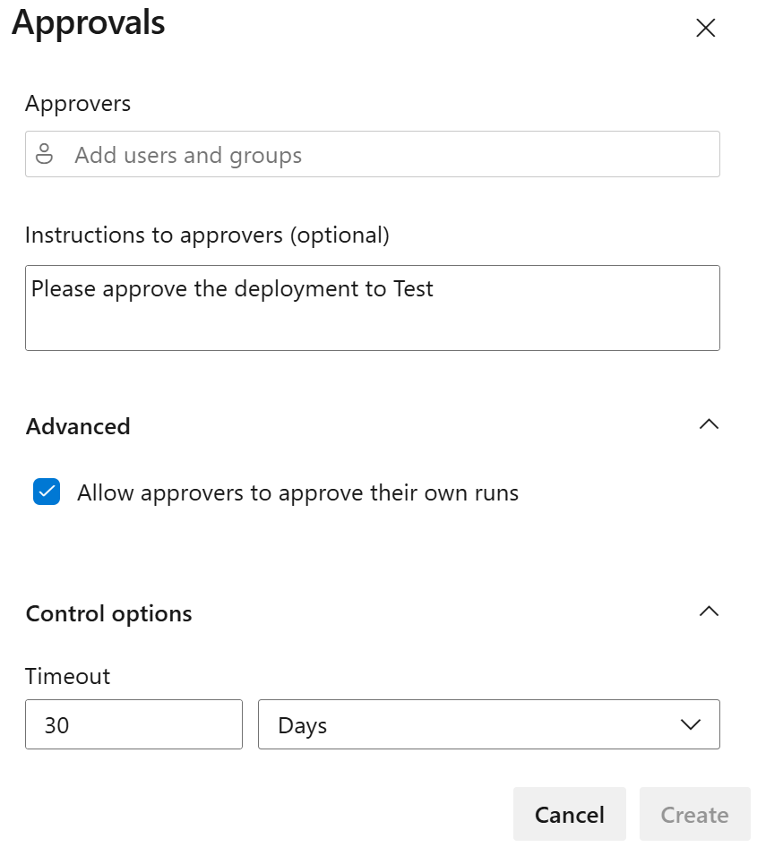

---
lab:
  title: アクセス許可を構成して検証する
  module: 'Module 4: Configure and validate permissions'
---

# アクセス許可を構成して検証する

このラボでは、最小限の特権の原則に従ってセキュリティで保護された環境を設定し、メンバーがタスクを実行し、潜在的なセキュリティ リスクを最小限に抑えるために必要なリソースにのみ確実にアクセスできるようにします。 これには、ユーザーとパイプラインのアクセス許可の構成と検証、および Azure DevOps での承認とブランチ チェックの設定が含まれます。

これらの演習の所要時間は約 **20** 分です。

## 開始する前に

ラボの演習を行うには、Azure サブスクリプション、Azure DevOps 組織、eShopOnWeb アプリケーションが必要です。

- 手順に従って[ラボ環境を検証](APL2001_M00_Validate_Lab_Environment.md)します。
- ラボ「[セキュリティで保護されたパイプライン用にエージェントとエージェント プールを構成する](APL2001_M02_L02_Configure_Agents_And_Agent_Pools_for_Secure_Pipelines.md)」または「[セルフホステッド エージェントをインストールする](https://learn.microsoft.com/azure/devops/pipelines/agents/windows-agent)」の手順に従ってセルフホステッド エージェントをインストールします。

## 手順

### 演習 0: (完了している場合はスキップしてください) CI/CD パイプラインをインポートして実行する

この演習では、Azure DevOps プロジェクトに CI/CD パイプラインをインポートして実行します。

#### タスク 1: (完了している場合はスキップしてください) CI パイプラインをインポートして実行する

まず、[eshoponweb-ci.yml](https://github.com/MicrosoftLearning/eShopOnWeb/blob/main/.ado/eshoponweb-ci.yml) という CI パイプラインをインポートします。

1. Azure DevOps ポータル (`https://aex.dev.azure.com`) に移動し、自分の組織を開きます。

1. Azure DevOps で **eShopOnWeb** プロジェクトを開きます。

1. **[パイプライン] > [パイプライン]** に移動します。

1. **[パイプラインを作成]** ボタンを選択します。

1. **[Azure Repos Git (Yaml)]** を選びます。

1. **eShopOnWeb** リポジトリを選びます。

1. **[既存の Azure Pipelines YAML ファイル]** を選びます。

1. **/.ado/eshoponweb-ci.yml** ファイルを選び、 **[続行]** をクリックします。

1. **[実行]** ボタンを選んでパイプラインを実行します。

   > **注**: パイプラインには、プロジェクト名に基づく名前が付けられます。 パイプラインを特定しやすいように名前を変更します。

1. **[パイプライン] > [パイプライン]** に移動し、先ほど作成したパイプラインを選択します。 省略記号を選択し、**[名前の変更/移動]** オプションを選択します。

1. **eshoponweb-ci** という名前を付けて、**[保存]** を選択します。

#### タスク 2: (完了している場合はスキップしてください) CD パイプラインをインポートして実行する

> **注**: このタスクでは、[eshoponweb-cd-webapp-code.yml](https://github.com/MicrosoftLearning/eShopOnWeb/blob/main/.ado/eshoponweb-cd-webapp-code.yml) という名前の CD パイプラインをインポートして実行します。

1. **[パイプライン] > [パイプライン]** に移動します。

1. **[新しいパイプライン]** ボタンを選択します。

1. **[Azure Repos Git (Yaml)]** を選びます。

1. **eShopOnWeb** リポジトリを選びます。

1. **[既存の Azure Pipelines YAML ファイル]** を選びます。

1. **/.ado/eshoponweb-cd-webapp-code.yml** ファイルを選び、**[続行]** を選びます。

1. YAML パイプライン定義で、変数セクションを次のように設定します。

   ```yaml
   variables:
     resource-group: 'YOUR-RESOURCE-GROUP-NAME'
     location: 'centralus'
     templateFile: 'infra/webapp.bicep'
     subscriptionid: 'YOUR-SUBSCRIPTION-ID'
     azureserviceconnection: 'YOUR-AZURE-SERVICE-CONNECTION-NAME'
     webappname: 'YOUR-WEB-APP-NAME'
   ```

1. 変数の値を実際の環境の値に置き換えます。

   - **YOUR-RESOURCE-GROUP-NAME** を、このラボで使用するリソース グループの名前 (たとえば、**rg-eshoponweb-secure**) に置き換えます。
   - **location** 変数の値を、リソースをデプロイする Azure リージョンの名前 (たとえば、**centralus**) に設定します。
   - **YOUR-SUBSCRIPTION-ID** を、お使いの Azure サブスクリプション ID に置き換えます。
   - **YOUR-AZURE-SERVICE-CONNECTION-NAME** を、**azure subs** に置き換えます
   - **YOUR-WEB-APP-NAME** を、デプロイする Web アプリのグローバル一意識別子 (たとえば、文字列 **eshoponweb-lab-multi-123456** の後にランダムな 6 桁の数字) に置き換えます。

1. **[保存および実行]** を選択し、メイン ブランチに直接コミットすることを選択します。

1. もう一度 **[保存および実行]** を選択します。

1. パイプライン実行を開きます。 "この実行を続行して [Web アプリへのデプロイ] に進む前に、リソースにアクセスするためのアクセス許可がこのパイプラインに必要です" というメッセージが表示された場合は、**[表示]**、**[許可]**、さらにもう一度 **[許可]** を選択します。 この操作は、パイプラインで Azure App Service リソースを作成するために必要です。

   

1. デプロイが完了するまでに数分かかる場合があります。パイプラインが実行されるまで待ちます。 パイプラインは、CI パイプラインの完了後にトリガーされ、次のタスクが含まれます。

   - **AzureResourceManagerTemplateDeployment**: bicep テンプレートを使用して Azure App Service Web アプリをデプロイします。
   - **AzureRmWebAppDeployment**: Web サイトを Azure App Service Web アプリに公開します。

   > **注**: デプロイに失敗した場合は、パイプライン実行ページに移動し、**[失敗したジョブの再実行]** を選択して別のパイプライン実行を呼び出します。

   > **注**: パイプラインには、プロジェクト名に基づく名前が付けられます。 パイプラインを識別しやすくするために、**名前を変更**しましょう。

1. **[パイプライン] > [パイプライン]** に移動し、先ほど作成したパイプラインを選択します。 省略記号を選択し、**[名前の変更/移動]** オプションを選択します。

1. **eshoponweb-cd-webapp-code** という名前を付け、 **[保存]** をクリックします。

### 演習 1: 承認とブランチ チェックを構成して検証する

この演習では、CD パイプラインの承認とブランチ チェックを構成して検証します。

#### タスク 1:環境を作成し、承認とチェックを追加する

1. Azure DevOps ポータルの **eShopOnWeb** プロジェクト ページから **[パイプライン] > [環境]** を選びます。

1. **[環境の作成]** を選択します。

1. 環境に「**Test**」という名前を付け、リソースとして **[なし]** を選び、**[作成]** を選びます。

1. **テスト**環境で、**[承認とチェック]** タブを選択します。

1. **[Approvals]** を選択します。

1. **[承認者]** テキスト ボックスにユーザー名を入力します。

1. 有効になっていない場合は、[承認者が自分の実行を承認することを許可する] というラベルのボックスをオンにします。

1. 「**Test へのデプロイを承認してください**」という指示を指定し、**[作成]** を選びます。

   

1. **[+ 新規追加]** ボタンをクリックし、**[ブランチ コントロール]** を選択してから **[次へ]** を選択します。

1. **[許可されたブランチ]** フィールドは既定値のままにして **[作成]** を選びます。 必要に応じて、さらにブランチを追加できます。

   

1. **Production** という名前の環境をもう 1 つ作成し、同じ手順を実行して承認とブランチ コントロールを追加します。 環境を区別できるように、「**Production へのデプロイを承認してください**」という指示を追加し、許可されるブランチを **refs/heads/main** に設定します。

> **注**: さらに環境を追加し、それらの承認とブランチ コントロールを構成できます。 さらに、**[セキュリティ]** を構成して、"ユーザー"、"作成者"、または "閲覧者" などのロールを持つユーザーまたはグループを環境に追加することもできます。******

#### タスク 2:新しい環境を使うように CD パイプラインを構成する

1. Azure DevOps ポータルの **eShopOnWeb** プロジェクト ページから **[パイプライン] > [パイプライン]** を選びます。

1. **eshoponweb-cd-webapp-code** パイプラインを開きます。

1. **編集**を選択します。

1. **#download artifacts** コメントの上にある行をパイプライン YAML ファイルの **stages:** 行まで選択し、その内容を次のコードに置き換えます。

   ```yaml
   stages:
   - stage: Test
     displayName: Testing WebApp
     jobs:
     - deployment: Test
       pool: eShopOnWebSelfPool
       environment: Test
       strategy:
         runOnce:
           deploy:
             steps:
             - script: echo Hello world! Testing environments!
   - stage: Deploy
     displayName: Deploy to WebApp
     jobs:
     - deployment: Deploy
       pool: eShopOnWebSelfPool
       environment: Production
       strategy:
         runOnce:
           deploy:
             steps:
             - checkout: self
   ```

   > **注**: YAML のインデント規則を確実に満たすために、上記のコードに続くすべての行を 6 スペース分、右にシフトする必要があります。

   パイプラインは次のようになっているはずです。

   

   > [!IMPORTANT]
   > **プール**名が前のラボで作成した名前と同じであることを確認します。

1. **[検証して保存]** をクリックし、メイン ブランチに直接コミットすることを選択してから、**[保存]** をクリックします。

1. パイプラインが自動的にトリガーされます。 パイプライン実行を開きます。

   > **注**: 「Web アプリのテストを続ける前に、リソースにアクセスするための許可がこのパイプラインに必要です」というメッセージが表示されたら、**[表示]**、**[許可]**、さらにもう一度 **[許可]** を選択します。

1. パイプラインの **Testing WebApp** ステージを開き、"**この実行を続行して Testing WebApp に進む前に、あなたが 1 件の承認をレビューする必要があります**" というメッセージが表示されます。 **[確認]** を選び、**[承認]** を選びます。

   

1. パイプラインが完了するまで待ち、パイプライン ログを開いて、**Testing WebApp** ステージが正常に実行されたことを確認します。

   

1. パイプラインに戻ると、承認待ちのステージ **Deploy to WebApp** が表示されます。 先ほどの **Testing WebApp** ステージと同様に、**[確認]** と **[承認]** を選びます。

   > **注**: "Web アプリへのデプロイを続ける前に、リソースにアクセスするための許可がこのパイプラインに必要です" というメッセージが表示されたら、**[表示]**、**[許可]**、さらにもう一度 **[許可]** を選択します。

1. パイプラインが完了するまで待ち、**Deploy to WebApp** ステージが正常に実行されたことを確認します。

   

> **注**: テスト環境と運用環境の両方で、承認とブランチ チェックを使用してパイプラインを正常に実行できるようになります。

> [!IMPORTANT]
> 不要な料金が発生しないように、Azure portal で作成されたリソースを必ず削除してください。

## 確認

このラボでは、最小限の特権の原則に従ってセキュリティで保護された環境を設定し、メンバーがタスクを実行し、潜在的なセキュリティ リスクを最小限に抑えるために必要なリソースにのみ確実にアクセスできるようにする方法を学びました。 ユーザーとパイプラインのアクセス許可を構成して検証し、Azure DevOps で承認とブランチ チェックを設定しました。
