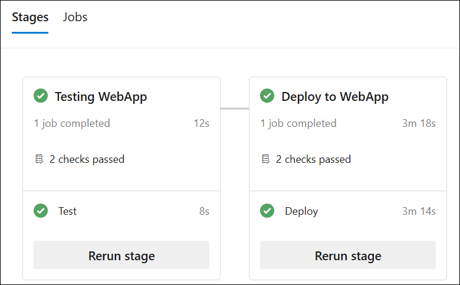

---
lab:
  title: アクセス許可を構成して検証する
  module: 'Module 4: Configure and validate permissions'
---

# アクセス許可を構成して検証する

このラボでは、最小限の特権の原則に従ってセキュリティで保護された環境を設定し、メンバーがタスクを実行し、潜在的なセキュリティ リスクを最小限に抑えるために必要なリソースにのみ確実にアクセスできるようにします。 これには、ユーザーとパイプラインのアクセス許可の構成と検証、および Azure DevOps での承認とブランチ チェックの設定が含まれます。

これらの演習の所要時間は約 **30** 分です。

## 開始する前に

ラボの演習を行うには、Azure サブスクリプション、Azure DevOps 組織、eShopOnWeb アプリケーションが必要です。

- 手順に従って[ラボ環境を検証](APL2001_M00_Validate_Lab_Environment.md)します。
- ラボ「[セキュリティで保護されたパイプライン用にエージェントとエージェント プールを構成する](/Instructions/Labs/APL2001_M02_L02_Configure_Agents_And_Agent_Pools_for_Secure_Pipelines.md)」または「[セルフホステッド エージェントをインストールする](https://docs.microsoft.com/azure/devops/pipelines/agents/v2-windows?view=azure-devops#install)」の手順に従ってセルフホステッド エージェントをインストールします。

## 手順

### 演習 1:CI パイプラインをインポートし、パイプライン固有のアクセス許可を構成する

この演習では、eShopOnWeb アプリケーションの CI パイプラインをインポートして実行し、パイプライン固有のアクセス許可を構成します。

#### タスク 1:CI パイプラインをインポートして実行する

> [!NOTE]
> まず、[eshoponweb-ci.yml](https://github.com/MicrosoftLearning/eShopOnWeb/blob/main/.ado/eshoponweb-ci.yml) という CI パイプラインをインポートします。

1. Azure DevOps ポータル (`https://dev.azure.com`) に移動し、自分の組織を開きます。

1. **eShopOnWeb** プロジェクトを開きます。

1. **[パイプライン] > [パイプライン]** に移動します。

1. **[新しいパイプライン]** を選択します。

1. **[Azure Repos Git (Yaml)]** を選びます。

1. **eShopOnWeb** リポジトリを選びます。

1. **[既存の Azure Pipelines YAML ファイル]** を選びます。

1. **/.ado/eshoponweb-ci.yml** ファイルを選び、**[続行]** を選びます。

1. **[実行]** ボタンを選んでパイプラインを実行します。

   > [!NOTE]
   > パイプラインには、プロジェクト名に基づく名前が付けられます。 名前を変更してパイプラインを識別しやすくします。

1. **[パイプライン] > [パイプライン]** に移動し、先ほど作成したパイプラインを選び、[...] を選んで **[名前の変更/移動]** オプションを選びます。

1. 「**eshoponweb-ci**」という名前を付け、**[保存]** を選びます。

#### タスク 2:特定のアクセス許可を使ってパイプラインを構成し、実行する

> [!NOTE]
> このタスクで構成したエージェント プールを使うには、まずエージェントをホストする Azure VM を起動する必要があります。 

1. ブラウザーで Azure Portal (`https://portal.azure.com`) を開きます。

1. Azure portal で、このラボでデプロイした Azure VM **eshoponweb-vm** を表示するページに移動します

1. **eshoponweb-vm** Azure VM ページのツール バーで、**[開始]** を選んで起動します。

   > [!NOTE]
   > 次に、対応するエージェント プールで実行されるように CI パイプラインを構成し、パイプラインを実行するアクセス許可を検証します。 パイプラインを編集し、エージェント プールにアクセス許可を追加するアクセス許可を持っている必要があります。

1. [プロジェクトの設定] に移動し、**[パイプライン]** で **[エージェント プール]** を選びます。

1. **eShopOnWebSelfPool** エージェント プールを開きます。

1. **[セキュリティ]** タブを選びます。

1. **[パイプラインのアクセス許可]** セクションで、**[+]** ボタンを選び、次に **eshoponweb-ci** パイプラインを選び、エージェント プールにアクセスできるパイプラインの一覧に追加します。

1. **eShopOnWeb** プロジェクト ページに移動します。

1. **eShopOnWeb** プロジェクト ページで **[パイプライン] > [パイプライン]** に移動します。

1. **eshoponweb-ci** パイプラインを選び、**[編集]** を選びます。

1. **stages** セクションの **jobs** サブセクションで、このタスクで構成したセルフホステッド エージェント プール **eShopOnWebSelfPool** を参照するように、次の形式で **pool** プロパティの値を更新します。

   ```yaml
     jobs:
     - job: Build
       pool: eShopOnWebSelfPool
       steps:
       - task: DotNetCoreCLI@2
   ```

1. **[保存]** を選び、メイン ブランチに直接コミットすることを選びます。

1. **保存**を再度選択します。

1. パイプラインの **[実行]** を選び、もう一度 **[実行]** をクリックします。

1. ビルド ジョブが **eShopOnWebSelfAgent** エージェント上で実行されており、正常に完了したことを確認します。

#### タスク 3:CD パイプラインを構成し、アクセス許可を検証する

1. Azure DevOps ポータルの **eShopOnWeb** プロジェクト ページで、**[パイプライン] > [パイプライン]** に移動します。

1. **[新しいパイプライン]** を選択します。

1. **[Azure Repos Git (Yaml)]** を選びます。

1. **eShopOnWeb** リポジトリを選びます。

1. **[既存の Azure Pipelines YAML ファイル]** を選びます。

1. **/.ado/eshoponweb-cd-webapp-code.yml** ファイルを選び、**[続行]** を選びます。

1. YAML パイプライン定義の変数セクションで、次のようにカスタマイズします。

   - **AZ400-EWebShop-NAME** を任意の名前に置き換えます (たとえば、**rg-eshoponweb-perm**)。
   - **Location** は、リソースをデプロイする Azure リージョンの名前に置き換えます (たとえば、**southcentralus**)。
   - **YOUR-SUBSCRIPTION-ID** を使用する Azure サブスクリプション ID にします。
   - **azure subs** を **azure subs managed** に置き換えます
   - **az400-webapp-NAME** を、デプロイする Web アプリのグローバルに一意な名前に置き換えます。たとえば、文字列 **eshoponweb-lab-perm-** に続けてランダムな 6 桁の数字を指定します。 

1. **eShopOnWebSelfPool** エージェント プールを使うように YAML ファイルを更新します。 これを行うには、**pool** セクションを次の値に設定します。

   ```yaml
     jobs:
     - job: Deploy
       pool: eShopOnWebSelfPool
       steps:
       #download artifacts
       - download: eshoponweb-ci
   ```

1. **[保存して実行]** を選び、もう一度 **[保存して実行]** を選びます。

1. パイプラインを開くと、"この実行を続行して Deploy to WebApp に進む前に、このパイプラインに 2 リソースにアクセスするためのアクセス許可が必要です" というメッセージが表示されます。 **[表示]** を選び、**[許可]** を選んでパイプラインの実行を許可します。

   ![パイプラインと [許可] ボタンのスクリーンショット。"](media/pipeline-permission-permit.png)

1. パイプラインの名前を **eshoponweb-cd-webapp-code** に変更します。

### 演習 2:承認とブランチのチェックを構成して検証する

この演習では、CD パイプラインの承認とブランチ チェックを構成して検証します。

#### タスク 1:環境を作成し、承認とチェックを追加する

1. Azure DevOps ポータルの **eShopOnWeb** プロジェクト ページから **[パイプライン] > [環境]** を選びます。

1. **[環境の作成]** を選択します。

1. 環境に「**Test**」という名前を付け、リソースとして **[なし]** を選び、**[作成]** を選びます。

1. **[新しい環境]** を選び、新しい環境「**Production**」を作成し、リソースとして **[なし]** が選択されていることを確認して、**[作成]** を選びます。

1. **Test** 環境を開き、**[承認とチェック]** タブを選びます。

1. **[Approvals]** を選択します。

1. **[承認者]** テキスト ボックスにユーザー名を入力します。

1. 「**Test へのデプロイを承認してください**」という指示を指定し、**[作成]** を選びます。

   

1. **[+]** ボタンを選び、**[ブランチ コントロール]** を選んで **[次へ]** を選びます。

1. **[許可されたブランチ]** フィールドは既定値のままにして **[作成]** を選びます。 必要に応じて、さらにブランチを追加できます。

   

1. **Production** という名前の環境をもう 1 つ作成し、同じ手順を実行して承認とブランチ コントロールを追加します。 環境を区別できるように、「**Production へのデプロイを承認してください**」という指示を追加し、許可されるブランチを **refs/heads/main** に設定します。

> [!NOTE]
> さらに環境を追加し、それらの承認とブランチ コントロールを構成できます。 さらに、**[セキュリティ]** を構成して、"ユーザー"、"作成者"、または "閲覧者" などのロールを持つユーザーまたはグループを環境に追加することもできます。******

#### タスク 2:新しい環境を使うように CD パイプラインを構成する

1. Azure DevOps ポータルの **eShopOnWeb** プロジェクト ページから **[パイプライン] > [パイプライン]** を選びます。

1. **eshoponweb-cd-webapp-code** パイプラインを開きます。

1. **編集**を選択します。

1. 21 行目から 27 行目 (**#download artifacts** コメントのすぐ上) を次の内容に置き換えます。

   ```yaml
   stages:
   - stage: Test
     displayName: Testing WebApp
     jobs:
     - deployment: Test
       pool: eShopOnWebSelfPool
       environment: Test
       strategy:
         runOnce:
           deploy:
             steps:
             - script: echo Hello world! Testing environments!
   - stage: Deploy
     displayName: Deploy to WebApp
     jobs:
     - deployment: Deploy
       pool: eShopOnWebSelfPool
       environment: Production
       strategy:
         runOnce:
           deploy:
             steps:
             - checkout: self
   ```

   > [!NOTE]
   > YAML のインデント規則を確実に満たすように、上記のコードに続くすべての行を、6 つのスペース分、右にシフトする必要があります。

   パイプラインは次のようになっているはずです。

   

1. **[保存]** (2 回) と **[実行]** (2 回) を選びます。

1. パイプラインの **Testing WebApp** ステージを開き、"**この実行を続行して Testing WebApp に進む前に、あなたが 1 件の承認をレビューする必要があります**" というメッセージが表示されます。 **[確認]** を選び、**[承認]** を選びます。

   

1. パイプラインが完了するまで待ち、パイプライン ログを開いて、**Testing WebApp** ステージが正常に実行されたことを確認します。

   

1. パイプラインに戻ると、承認待ちのステージ **Deploy to WebApp** が表示されます。 先ほどの **Testing WebApp** ステージと同様に、**[確認]** と **[承認]** を選びます。

1. パイプラインが完了するまで待ち、**Deploy to WebApp** ステージが正常に実行されたことを確認します。

   

> [!NOTE]
> テスト環境と運用環境の両方で、承認とブランチ チェックを使ってパイプラインを正常に実行できるはずです。

### 演習 3:Azure と Azure DevOps リソースのクリーンアップを実行する

この演習では、このラボで作成した Azure と Azure DevOps のリソースを削除します。

#### タスク 1:Azure リソースを削除する

1. Azure portal で、デプロイされたリソースを含むリソース グループ **rg-eshoponweb-perm** に移動し、**[リソース グループの削除]** を選んで、このラボで作成されたすべてのリソースを削除します。

#### タスク 2:Azure DevOps パイプラインを削除する

1. Azure DevOps ポータル (`https://dev.azure.com`) に移動し、自分の組織を開きます。

1. **eShopOnWeb** プロジェクトを開きます。

1. **[パイプライン] > [パイプライン]** に移動します。

1. **[パイプライン] > [パイプライン]** に移動し、既存のパイプラインを削除します。

#### タスク 3:Azure DevOps リポジトリを再作成する

1. Azure DevOps ポータルの **eShopOnWeb** プロジェクトで、左下隅にある **[プロジェクトの設定]** を選びます。

1. 左側の **[プロジェクトの設定]** 縦型メニューの **[リポジトリ]** セクションで、**[リポジトリ]** を選びます。

1. **[すべてのリポジトリ]** ペインで、**eShopOnWeb** リポジトリ エントリの右端にマウス ポインターを置き、**[その他のオプション]** の [...] アイコンが表示されたら、それを選びます。**[その他のオプション]** メニューで **[名前の変更]** を選びます。  

1. **[eShopOnWeb リポジトリの名前を変更する]** ウィンドウの **[リポジトリ名]** テキスト ボックスに「**eShopOnWeb_old**」と入力し、**[名前の変更]** を選びます。

1. **[すべてのリポジトリ]** ペインに戻り、**[+ 作成]** を選びます。

1. **[リポジトリの作成]** ペインの **[リポジトリ名]** テキスト ボックスに「**eShopOnWeb**」と入力し、**[Readme の追加]** チェックボックスをオフにして、**[作成]** を選びます。

1. **[すべてのリポジトリ]** ペインに戻り、**eShopOnWeb_old** リポジトリ エントリの右端にマウス ポインターを置き、**[その他のオプション]** の [...] アイコンが表示されたら、それを選びます。**[その他のオプション]** メニューで **[削除]** を選びます。  

1. **[eShopOnWeb_old リポジトリの削除]** ウィンドウで「**eShopOnWeb_old**」と入力し、**[削除]** を選びます。

1. Azure DevOps ポータルの左側のナビゲーション メニューで **[リポジトリ]** を選びます。

1. **[eShopOnWeb は空です。]** をクリックします。 ペインで **[リポジトリのインポート]** を選びます。

1. **[Git リポジトリをインポートする]** ウィンドウで、URL `https://github.com/MicrosoftLearning/eShopOnWeb` を貼り付けて、**[インポート]** を選びます。

## 確認

このラボでは、最小限の特権の原則に従ってセキュリティで保護された環境を設定し、メンバーがタスクを実行し、潜在的なセキュリティ リスクを最小限に抑えるために必要なリソースにのみ確実にアクセスできるようにする方法を学びました。 ユーザーとパイプラインのアクセス許可を構成して検証し、Azure DevOps で承認とブランチ チェックを設定しました。
