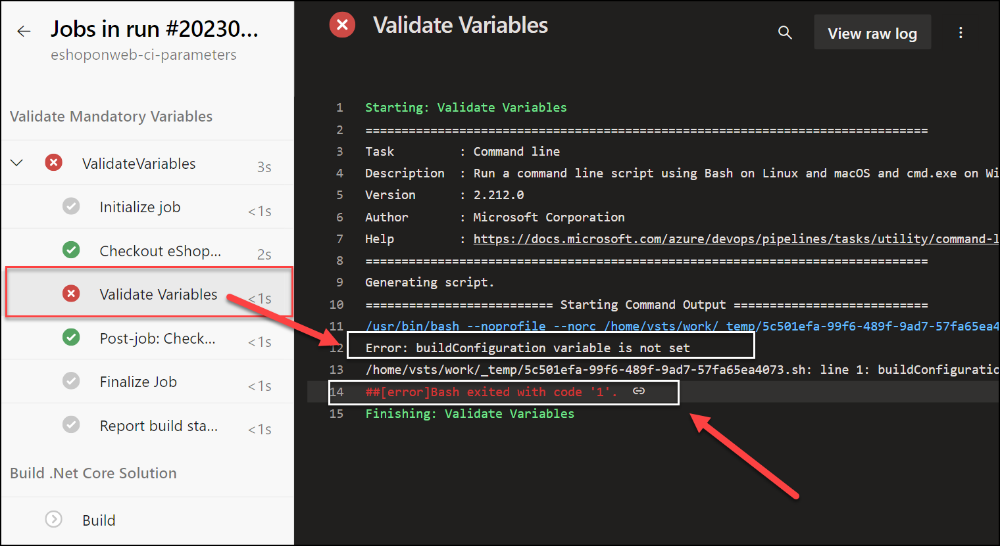

---
lab:
  title: 変数とパラメーターを安全に使用するようにパイプラインを構成する
  module: 'Module 7: Configure pipelines to securely use variables and parameters'
---

# 変数とパラメーターを安全に使用するようにパイプラインを構成する

このラボでは、変数とパラメーターを安全に使用するようにパイプラインを構成する方法について学習します。

これらの演習の所要時間は約 **20** 分です。

## 開始する前に

ラボの演習を行うには、Azure サブスクリプション、Azure DevOps 組織、eShopOnWeb アプリケーションが必要です。

- 手順に従って[ラボ環境を検証](APL2001_M00_Validate_Lab_Environment.md)します。

## 手順

### 演習 1:パラメーターと変数の型を確認する

#### タスク 1: CI パイプラインをインポートして実行する

まず、[eshoponweb-ci.yml](https://github.com/MicrosoftLearning/eShopOnWeb/blob/main/.ado/eshoponweb-ci.yml) という CI パイプラインをインポートします。

1. Azure DevOps ポータル (`https://dev.azure.com`) に移動し、自分の組織を開きます。

1. eShopOnWeb プロジェクトを開きます。

1. **[パイプライン] > [パイプライン]** に移動します。

1. **[Create Pipeline]** を選択します。

1. **[Azure Repos Git (Yaml)]** を選びます。

1. **eShopOnWeb** リポジトリを選びます。

1. **[既存の Azure Pipelines YAML ファイル]** を選びます。

1. **/.ado/eshoponweb-ci.yml** ファイルを選び、**[続行]** を選びます。

1. **[実行]** ボタンを選んでパイプラインを実行します。

   > [!NOTE]
   > パイプラインには、プロジェクト名に基づく名前が付けられます。 名前を変更してパイプラインを識別しやすくします。

1. **[パイプライン] > [パイプライン]** に移動し、先ほど作成したパイプラインを選択します。 省略記号と **[名前の変更または移動]** オプションを選択します。

1. **eshoponweb-ci-parameters** という 名前を付け、**[保存]** を選択します。

#### タスク 2:YAML パイプラインのパラメーターの型を確認する

このタスクでは、パイプラインのパラメーターとパラメーターの型を設定します。

1. **[パイプライン] > [パイプライン]** に移動し、**eshoponweb-ci-parameters** パイプラインを選択します。

1. **編集**を選択します。

1. YAML ファイルの先頭に以下のパラメーターとリソースのセクションを追加します。

   ```yaml
   parameters:
   - name: dotNetProjects
     type: string
     default: '**/*.sln'
   - name: testProjects
     type: string
     default: 'tests/UnitTests/*.csproj'

   resources:
     repositories:
     - repository: self
       trigger: none

   ```

1. `Restore`、`Build`、`Test` タスクのハードコーディングされたパスを、先ほど作成したパラメーターに置き換えます。

   - **プロジェクトの置き換え**: `**/*.sln` プロジェクト: `Restore` および `Build` タスク内の `${{ parameters.dotNetProjects }}`。
   - **プロジェクトの置き換え**: `tests/UnitTests/*.csproj` プロジェクト: `Test` タスク内の `${{ parameters.testProjects }}`

    YAML ファイルの steps セクションの `Restore`、`Build`、`Test` タスクは次のようになります。

    

    ```yaml
    steps:
    - task: DotNetCoreCLI@2
      displayName: Restore
      inputs:
        command: 'restore'
        projects: ${{ parameters.dotNetProjects }}
        feedsToUse: 'select'
    
    - task: DotNetCoreCLI@2
      displayName: Build
      inputs:
        command: 'build'
        projects: ${{ parameters.dotNetProjects }}
    
    - task: DotNetCoreCLI@2
      displayName: Test
      inputs:
        command: 'test'
        projects: ${{ parameters.testProjects }}
    
    ```

    

1. パイプラインを保存して実行します。 パイプラインの実行が正常に完了することを確認します。

   

#### タスク 3:変数とパラメーターを保護する

このタスクでは、パイプラインから変数グループを使用して、変数とパラメーターを保護します。

1. **[パイプライン] > [ライブラリ]** に移動します。

1. **[+ 変数グループ]** ボタンを選択して、**BuildConfigurations** という名前の新しい変数グループを作成します。

1. **buildConfiguration** という名前の変数を追加し、その値を `Release` に設定します。

1. 変数グループを保存します。

   

1. **[パイプラインのアクセス許可]** ボタンを選択し、新しいパイプラインを追加する **[+]** ボタンを選択します。

1. **eshoponweb-ci-parameters** パイプラインを選択して、パイプラインで変数グループを使用できるようにします。

   

   > [!NOTE]
   > **[セキュリティ]** ボタンをクリックして、特定のユーザーまたはグループが変数グループを編集できるように設定することもできます。

1. **[パイプライン] > [パイプライン]** に移動します。

1. **eshoponweb-ci-parameters** パイプラインを開き、**[編集]** を選択します。

1. yml ファイルの先頭にあるパラメーターのすぐ下で、以下を追加して変数グループを参照します。

   ```yaml
   variables:
     - group: BuildConfigurations
   ```

1. 'Build' タスクで、command: 'build' を以下の行に置き換えて、変数グループからビルド構成を利用します。

    

    ```yaml
            command: 'build'
            projects: ${{ parameters.dotNetProjects }}
            configuration: $(buildConfiguration)
    ```

    

1. パイプラインを保存して実行します。 ビルド構成が `Release` に設定された状態で、正常に実行されます。 これを確認するには、'Build' タスクのログを確認します。

> [!NOTE]
> この方法に従うと、変数グループを使用して変数とパラメーターを保護することができ、YAML ファイルにハードコーディングする必要はありません。

#### タスク 4:必須の変数とパラメーターを検証する

このタスクでは、パイプラインを実行する前に必須の変数を検証します。

1. **[パイプライン] > [パイプライン]** に移動します。

1. **eshoponweb-ci-parameters** パイプラインを開き、**[編集]** を選択します。

1. stages セクションの先頭 (`stage:` 行の後) に、パイプラインの実行前に必須の変数を検証する **Validate** という名前の新しいステージを追加します。

    ```yaml
    - stage: Validate
      displayName: Validate mandatory variables
      jobs:
      - job: ValidateVariables
        pool:
          vmImage: ubuntu-latest
        steps:
        - script: |
            if [ -z "$(buildConfiguration)" ]; then
              echo "Error: buildConfiguration variable is not set"
              exit 1
            fi
          displayName: 'Validate Variables'
     ```

    > [!NOTE]
    > このステージでは、buildConfiguration 変数を検証するスクリプトを実行します。 変数が設定されていない場合、スクリプトは失敗し、パイプラインは停止します。

1. **Build** ステージの先頭に `dependsOn: Validate` を追加して、**Build** ステージを **Validate** ステージに依存させます。

    ```yaml
    - stage: Build
      displayName: Build .Net Core Solution
      dependsOn: Validate
    ```

1. パイプラインを保存して実行します。 buildConfiguration 変数が変数グループに設定されているため、正常に実行されます。

1. 検証をテストするには、変数グループから buildConfiguration 変数を削除するか、変数グループを削除して、パイプラインをもう一度実行します。 次のエラーにより失敗します。

    ```yaml
    Error: buildConfiguration variable is not set   
    ```

    

1. 変数グループを追加し、buildConfiguration 変数を変数グループに追加し直し、パイプラインをもう一度実行します。 これは正常に実行される必要があります。

## 確認

このラボでは、変数とパラメーターを安全に使用するようにパイプラインを構成する方法と、必須の変数とパラメーターを検証する方法について学習しました。
